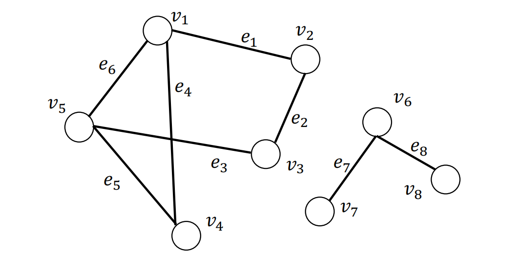
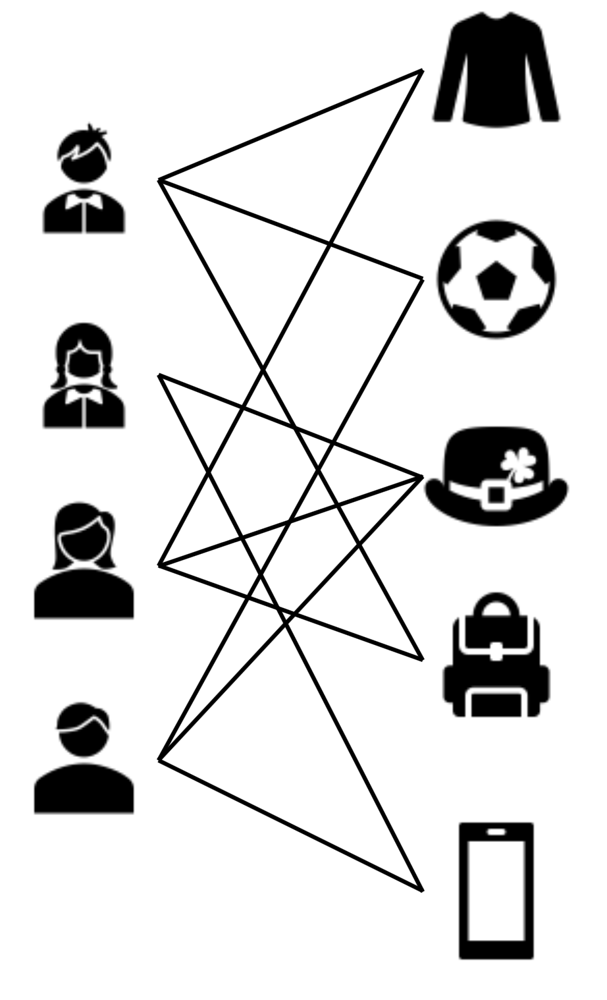
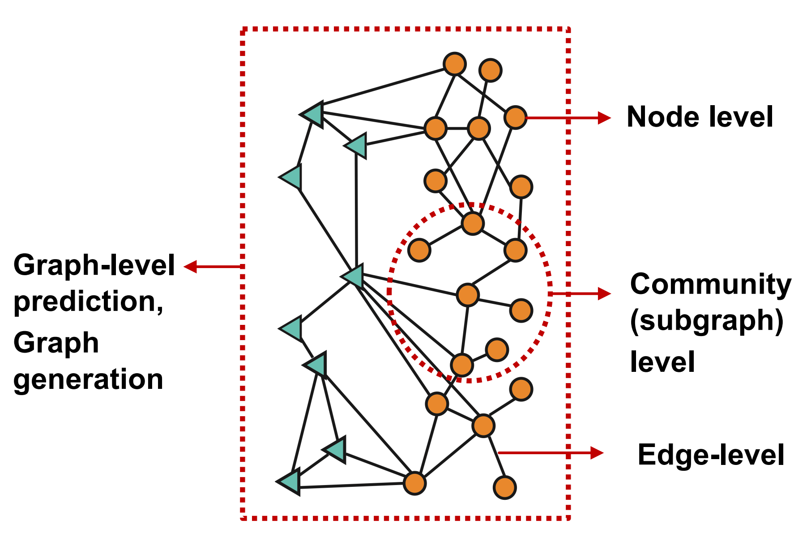
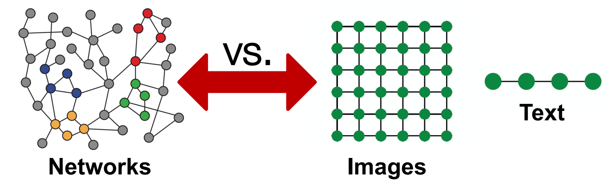

# 图结构数据

## 一、图的表示

**定义一（图）**：一个图被记为$\mathcal{G}=\{\mathcal{V}, \mathcal{E}\}$，其中 $\mathcal{V}=\left\{v_{1}, \ldots, v_{N}\right\}$是数量为$N=|\mathcal{V}|$ 的结点的集合， $\mathcal{E}=\left\{e_{1}, \ldots, e_{M}\right\}$ 是数量为 $M$ 的边的集合。图用节点表示实体（entities ），用边表示实体间的关系。节点和边的信息可以是分类的（typed ），分类的信息就称为标签，有节点的标签与边的标签，节点和边的信息可以是数值的，数值的信息就称为属性，有节点的属性与边的属性。

**定义二（图的邻接矩阵）**：给定一个图$\mathcal{G}=\{\mathcal{V}, \mathcal{E}\}$，其对应的邻接矩阵被记为$\mathbf{A} \in\{0,1\}^{N \times N}$。$\mathbf{A}_{i, j}=1$表示存在从结点$v_i$到$v_j$的边，反之表示不存在从结点$v_i$到$v_j$的边。

在无向图中，存在从结点$v_i$到$v_j$的边即意味着存在从结点$v_j$到$v_i$的边。因而无向图的邻接矩阵是对称的。

在无权图中，各条边的权重被认为是等价的，即认为各条边的权重为$1$。对于有权图，其对应的邻接矩阵通常被记为$\mathbf{W} \in\{0,1\}^{N \times N}$，其中$\mathbf{A}_{i, j}=w_{ij}$表示从结点$v_i$到$v_j$的边的权重。若不存在边，即认为边的权重为$0$。

一个无向无权图的例子：

其邻接矩阵为：
$$
\mathbf{A}=\left(\begin{array}{lllll}
0 & 1 & 0 & 1 & 1 \\
1 & 0 & 1 & 0 & 0 \\
0 & 1 & 0 & 0 & 1 \\
1 & 0 & 0 & 0 & 1 \\
1 & 0 & 1 & 1 & 0
\end{array}\right)
$$

## 二、图的属性

**定义三（结点的度，degree）**：对于有向有权图，结点$v_i$的出度（out degree）等于从$v_i$出发的边的权重之和，结点$v_i$的入度（in degree）等于从连向$v_i$的边的权重之和；无向图是有向图的特殊情况，结点的出度与入度相等。无权图是有权图的特殊情况，各边的权重为$1$，那么结点$v_i$的出度（out degree）等于从$v_i$出发的边的数量，结点$v_i$的入度（in degree）等于从连向$v_i$的边的数量。结点$v_i$的度记为$d(v_i)$。

**定义四（邻接结点，neighbors）**：结点$v_i$的邻接结点为与结点$v_i$邻接的结点，其被记为$\mathcal{N(v_i)}$。$k$跳远的邻居节点（neighbors with $k$-hop）指的是距离为$k$的邻居节点（一个节点的$2$跳远的邻居节点包含了自身）

**定义五（行走，walk）**：$walk(v_1, v_2) = (v_1, e_6,e_5,e_4,e_1,v_2)$。

**定理六**：有一图，其邻接矩阵为 $\mathbf{A}$, $\mathbf{A}^{n}$为邻接矩阵的$n$次方，那么$\mathbf{A}^{n}[i,j]$等于从结点$v_i$到结点$v_j$的程度为$n$的行走的个数。

**定义七（路径，path）**：路径是结点不重复的行走。

**定义八（子图，subgraph）**：有一图$\mathcal{G}=\{\mathcal{V}, \mathcal{E}\}$，另有一图$\mathcal{G}^{\prime}=\{\mathcal{V}^{\prime}, \mathcal{E}^{\prime}\}$，其中$\mathcal{V}^{\prime} \in \mathcal{V}$，$\mathcal{E}^{\prime} \in \mathcal{E}$并且$\mathcal{V}^{\prime}$不包含$\mathcal{E}^{\prime}$中未出现过的结点，那么$\mathcal{G}^{\prime}$是$\mathcal{G}$的子图。

**定义九（连通分量，connected component）**：给定图$\mathcal{G}^{\prime}=\{\mathcal{V}^{\prime}, \mathcal{E}^{\prime}\}$是图$\mathcal{G}=\{\mathcal{V}, \mathcal{E}\}$的子图。记属于图$\mathcal{G}$但不属于$\mathcal{G}^{\prime}$图的结点集合记为$\mathcal{V}/\mathcal{V}^{\prime}$ 。如果属于$\mathcal{V}^{\prime}$的任意结点对之间存在至少一条路径，但不存在一条边连接属于$\mathcal{V}^{\prime}$的结点与属于$\mathcal{V}/\mathcal{V}^{\prime}$的结点，那么图$\mathcal{G}^{\prime}$是图$\mathcal{G}$的连通分量。

左右两边子图都是整图的连通分量。

**定义十（连通图，connected graph）**：整图是一个连通分量，那么改图是一个连通图。

**定义十一（最短路径，shortest path）**：$v_{s}, v_{t} \in \mathcal{V}$ 是图$\mathcal{G}=\{\mathcal{V}, \mathcal{E}\}$上的一对结点，结点对$v_{s}, v_{t} \in \mathcal{V}$之间所有路径的集合记为$\mathcal{P}_{\mathrm{st}}$。结点对$v_{s}, v_{t}$之间的最短路径$p_{\mathrm{s} t}^{\mathrm{sp}}$为它们之间所有路径中路径最短的一条，其形式化定义为
$$
p_{\mathrm{s} t}^{\mathrm{sp}}=\arg \min _{p \in \mathcal{P}_{\mathrm{st}}}|p|
$$
其中，$p$表示$\mathcal{P}_{\mathrm{st}}$中的一条路径，$|p|$是路径$p$的长度。

**定义十二（直径，diameter）**：给定一个连通图$\mathcal{G}=\{\mathcal{V}, \mathcal{E}\}$，其直径为其所有结点对之间的最短路径的最小值，形式化定义为
$$
\operatorname{diameter}(\mathcal{G})=\max _{v_{s}, v_{t} \in \mathcal{V}} \min _{p \in \mathcal{P}_{s t}}|p|
$$

**定义十三（拉普拉斯矩阵，Laplacian Matrix）**：给定一个图$\mathcal{G}=\{\mathcal{V}, \mathcal{E}\}$，其邻接矩阵为$A$，其拉普拉斯矩阵定义为$\mathbf{L=D-A}$，其中$\mathbf{D=diag(d(v_1), \cdots, d(v_N))}$。

**定义十四（对称归一化的拉普拉斯矩阵，Symmetric normalized Laplacian）**：给定一个图$\mathcal{G}=\{\mathcal{V}, \mathcal{E}\}$，其邻接矩阵为$A$，其规范化的拉普拉斯矩阵定义为
$$
\mathbf{L=D^{-\frac{1}{2}}(D-A)D^{-\frac{1}{2}}=I-D^{-\frac{1}{2}}AD^{-\frac{1}{2}}}
$$

学习更多图的属性请参看 "Chapter 2 - Foundations of Graphs, Deep Learning on Graphs"

## 三、图的种类

- 同质图（Homogeneous Graph）：只有一种类型的节点和一种类型的边的图。
- 异质图（Heterogeneous Graph）：存在多种类型的节点和多种类型的边的图。
  
  图片来源："Chapter 2 - Foundations of Graphs, Deep Learning on Graphs"
- 二部图（Bipartite Graphs）：节点分为两类，只有不同类的节点之间存在边。
  
  图片来源："Chapter 2 - Foundations of Graphs, Deep Learning on Graphs"

## 四、图结构数据上的机器学习

1. 节点预测，预测节点的类别或某类属性的取值
   1. 例子：对是否是潜在客户分类、对游戏玩家的消费能力做预测
2. 边预测，预测两个节点间是否存在链接
   1. 例子：Knowledge graph completion、好友推荐、商品推荐
3. 图的分类，对不同的图进行分类或预测图的属性
   1. 例子：分子属性预测
4. 聚类，检测节点是否形成一个社区
   1. 例子：社交圈检测
5. 其他任务
   1. 图生成，例如药物发现
   2. 图演变，例如物理模拟

## 五、图结构数据上的机器学习的挑战

相较于图像数据和时间序列数据等规则的数据，在图结构数据上做机器学习任务的挑战。

1. 任意的大小和复杂的拓扑结构。
2. 没有固定的结点排序或参考点。
3. 通常是动态的，并具有多模态的特征。

## 六、结语

在此篇文章中，我们学习了简单的图论知识。对于今后的大部分图应用，掌握这些图论知识已经足够。如果有小伙伴希望掌握更多的图论知识可以参阅“Chapter 2 - Foundations of Graphs, Deep Learning on Graphs”。
