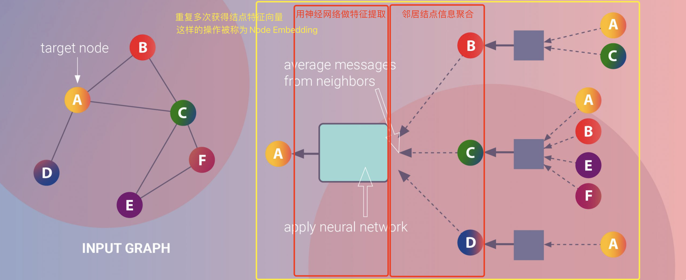

# 消息传递范式

## 一、引言

在开篇词中我们学过，图计算方法研究的一个主要方向是为节点构建一组特征来存储节点和其邻接节点的信息。消息传递范式是一种聚合邻居节点信息来更新中心节点信息的范式，它将卷积算子推广到了不规则数据领域，实现了图与神经网络的连接。此范式包含三个步骤：邻居节点信息变换、邻居节点信息聚合到中心节点、中心节点信息变换。因其简单且强大的特性，它广泛地被人们所采用。在此篇文章中，我们将学习消息传递范式的知识，以及如何基于消息传递范式实现图神经网络。

## 二、 消息传递范式介绍

用$\mathbf{x}^{(k-1)}_i\in\mathbb{R}^F$表示$(k-1)$层中节点$i$的节点特征，$\mathbf{e}_{j,i} \in \mathbb{R}^D$ 表示从节点$j$到节点$i$的边的特征，消息传递图神经网络可以描述为
$$
\mathbf{x}_i^{(k)} = \gamma^{(k)} \left( \mathbf{x}_i^{(k-1)}, \square_{j \in \mathcal{N}(i)} \, \phi^{(k)}\left(\mathbf{x}_i^{(k-1)}, \mathbf{x}_j^{(k-1)},\mathbf{e}_{j,i}\right) \right),
$$
其中$\square$表示可微分的、具有排列不变性（函数输出结果与输入参数的排列无关）的函数。具有排列不变性的函数有，和函数、均值函数和最大值函数。$\gamma$和$\phi$表示可微分的函数，如MLPs（多层感知器）。

下方图片展示了基于消息传递范式的节点嵌入（Node Embedding）的过程，

1. 在图的最右侧，B节点的邻居节点，A、C，的信息传递给了B，经过信息变换得到了B的嵌入，C、D节点同。
2. 在图的中右侧，A节点的邻居节点，B、C、D，的之前得到的节点嵌入传递给了节点A；在图的中左侧，聚合得到的信息经过信息变换得到了A节点新的嵌入。
3. 重复多次，我们可以得到每一个节点的经过多次信息变换的嵌入。这样的经过多次信息聚合与变换的节点嵌入就可以作为节点的表征，可以用于节点的分类。



## 三、Pytorch Geometric中的`MessagePassing`基类

Pytorch Geometric(PyG)提供了[`MessagePassing`](https://pytorch-geometric.readthedocs.io/en/latest/modules/nn.html#torch_geometric.nn.conv.message_passing.MessagePassing)基类，它实现了消息传播的自动处理，从而帮助我们继承该类的消息传递图神经网络。我们只需定义函数$\phi$，即[`message()`](https://pytorch-geometric.readthedocs.io/en/latest/modules/nn.html#torch_geometric.nn.conv.message_passing.MessagePassing.message)函数，和函数$\gamma$，即[`update()`](https://pytorch-geometric.readthedocs.io/en/latest/modules/nn.html#torch_geometric.nn.conv.message_passing.MessagePassing.update)函数，以及使用的消息聚合方案，即`aggr="add"`、`aggr="mean"`或`aggr="max"`。

这些是在以下方法的帮助下完成的：	

- `MessagePassing(aggr="add", flow="source_to_target", node_dim=-2)`: 定义了要使用的聚合方案（"add"、"mean "或 "max"）和消息传递的流向（"source_to_target "或 "target_to_source"）。此外，`node_dim`属性表示沿着哪个轴线传播。
- `MessagePassing.propagate(edge_index, size=None, **kwargs)`。开始传播消息的起始调用。它以`edge_index`（边的端点的索引）和`flow`（消息的流向）以及一些额外的数据为参数。请注意，`propagate()`不仅限于在形状为`[N, N]`的对称邻接矩阵中交换消息，还可以通过传递`size=(N, M)`作为额外参数，例如，在二部图的形状为`[N, M]`的一般稀疏分配矩阵中交换消息。如果设置`size=None`，则假定邻接矩阵是对称的。对于有两个独立的节点集合和索引集合的二部图，并且每个集合都持有自己的信息，我们可以传递一个元组参数，即`x=(x_N, x_M)`，来标记信息的区分。
- `MessagePassing.message(...)`: 首先确定要给节点$i$传递消息的边的集合，如果`flow="source_to_target"`，则是$(j,i) \in \mathcal{E}$的集合；如果`flow="target_to_source"`，则是$(i,j) \in \mathcal{E}$的集合。接着为各条边创建要传递给节点$i$的消息，即实现$\phi$函数。`MessagePassing.message(...)`函数接受最初传递给`MessagePassing.propagate(edge_index, size=None, **kwargs)`函数的所有参数。此外，传递给`propagate()`的张量可以被映射到各自的节点$i$和$j$上，只需在变量名后面加上`_i`或`_j`。请注意，我们把$i$称为消息传递的目标中心节点，把$j$称为邻居节点，因为这是最常用的符号。
- `MessagePassing.aggregate(...)`：将从源节点传递过来的消息聚合在目标节点上，一般可选的聚合方式有`sum`, `mean`和`max`。
- `MessagePassing.message_and_aggregate(...)`：在一些场景里，邻居节点信息变换和邻居节点信息聚合这两项操作可以融合在一起，那么我们可以在此函数里定义这两项操作，从而让程序运行更加高效。
- `MessagePassing.update(aggr_out, ...)`: 为每个节点$i \in \mathcal{V}$更新节点表征，即实现$\gamma$函数。该函数以聚合函数的输出为第一个参数，并接收所有传递给`propagate()`函数的参数。

## 四、继承`MessagePassing`类的GCN Layer

GCN Layer的数学定义为
$$
\mathbf{x}_i^{(k)} = \sum_{j \in \mathcal{N}(i) \cup \{ i \}} \frac{1}{\sqrt{\deg(i)} \cdot \sqrt{\deg(j)}} \cdot \left( \mathbf{\Theta} \cdot \mathbf{x}_j^{(k-1)} \right),
$$
其中，相邻节点的特征首先通过权重矩阵$\mathbf{\Theta}$进行转换，然后按端点的度进行归一化处理，最后进行加总。这个公式可以分为以下几个步骤：

1. 向邻接矩阵添加自环边。
1. 线性转换节点特征矩阵。
1. 计算归一化系数。
1. 归一化$j$中的节点特征。
1. 将相邻节点特征相加（"求和 "聚合）。

步骤1-3通常是在消息传递发生之前计算的。步骤4-5可以使用[`MessagePassing`](https://pytorch-geometric.readthedocs.io/en/latest/modules/nn.html#torch_geometric.nn.conv.message_passing.MessagePassing)基类轻松处理。该层的全部实现如下所示。

```python
import torch
from torch_geometric.nn import MessagePassing
from torch_geometric.utils import add_self_loops, degree

class GCNConv(MessagePassing):
    def __init__(self, in_channels, out_channels):
        super(GCNConv, self).__init__(aggr='add', flow='source_to_target')
        # "Add" aggregation (Step 5).
        # flow='source_to_target' 表示消息从源节点传播到目标节点
        self.lin = torch.nn.Linear(in_channels, out_channels)

    def forward(self, x, edge_index):
        # x has shape [N, in_channels]
        # edge_index has shape [2, E]

        # Step 1: Add self-loops to the adjacency matrix.
        edge_index, _ = add_self_loops(edge_index, num_nodes=x.size(0))

        # Step 2: Linearly transform node feature matrix.
        x = self.lin(x)

        # Step 3: Compute normalization.
        row, col = edge_index
        deg = degree(col, x.size(0), dtype=x.dtype)
        deg_inv_sqrt = deg.pow(-0.5)
        norm = deg_inv_sqrt[row] * deg_inv_sqrt[col]

        # Step 4-5: Start propagating messages.
        return self.propagate(edge_index, x=x, norm=norm)

    def message(self, x_j, norm):
        # x_j has shape [E, out_channels]
        # Step 4: Normalize node features.
        return norm.view(-1, 1) * x_j

```

[`GCNConv`](https://pytorch-geometric.readthedocs.io/en/latest/modules/nn.html#torch_geometric.nn.conv.GCNConv)继承了`MessagePassing`并以"求和"作为领域节点信息聚合方式。该层的所有逻辑都发生在其`forward()`方法中。在这里，我们首先使用`torch_geometric.utils.add_self_loops()`函数向我们的边索引添加自循环边（步骤1），以及通过调用`torch.nn.Linear`实例对节点特征进行线性变换（步骤2）。

归一化系数是由每个节点的节点度得出的，它被转换为每个边的节点度。结果被保存在形状`[num_edges,]`的张量`norm`中（步骤3）。

在[`message()`](https://pytorch-geometric.readthedocs.io/en/latest/modules/nn.html#torch_geometric.nn.conv.message_passing.MessagePassing.message)函数中，我们需要通过`norm`对相邻节点特征`x_j`进行归一化处理。这里，`x_j`包含每条边的源节点特征，即每个中心节点的邻居。

这就是创建一个简单的x传递层的全部内容。我们可以把这个层作为深度架构的构建块。我们可以很方便地初始化和调用它：

```python
conv = GCNConv(16, 32)
x = conv(x, edge_index)
```

## 五、`propagate`函数

`propagate`函数源码：

```python
def propagate(self, edge_index: Adj, size: Size = None, **kwargs):
    r"""开始消息传播的初始调用。
    Args:
        edge_index (Tensor or SparseTensor): 定义了消息传播流。
        	当flow="source_to_target"时，节点`edge_index[0]`的信息将被发送到节点`edge_index[1]`，
        	反之当flow="target_to_source"时，节点`edge_index[1]`的信息将被发送到节点`edge_index[0]`
        kwargs: 图其他属性或额外的数据。
    """
```

`edge_index`是`propagate`函数必须的参数。在我们的`message`函数中希望接受到哪些数据（或图的属性或额外的数据），就要在`propagate`函数的调用中传递哪些参数。

## 六、覆写`message`函数

在第四部分例子中，我们覆写的`message`函数接收两个参数`x_j`和`norm`，而`propagate`函数被传递三个参数`edge_index, x=x, norm=norm`。由于`x`是`Data`类的属性，且`message`函数接收`x_j`参数而不是`x`参数，所以在`propagate`函数被调用，`message`函数被执行之前，一项额外的操作被执行，该项操作根据`edge_index`参数从`x`中分离出`x_j`。事实上，在`message`函数里，当参数是`Data`类的属性时，我们可以在参数名后面拼接`_i`或`_j`来指定要接收源节点的属性或是目标节点的属性。类似的，如果我们希望在`message`函数中额外再接受源节点的度，那么我们做如下的修改（假设节点的度为`deg`，它是`Data`对象的属性）：

```python
class GCNConv(MessagePassing):
    def forward(self, x, edge_index):
        # ....
        return self.propagate(edge_index, x=x, norm=norm, d=d)
    def message(self, x_j, norm, d_i):
        # x_j has shape [E, out_channels]
        return norm.view(-1, 1) * x_j * d_i # 这里不管正确性
        
```

## 七、覆写`aggregate`函数

我们在前面的例子中增加如下的`aggregate`函数，通过观察运行结果我们发现，我们覆写的`aggregate`函数被调用，同时在`super(GCNConv, self).__init__(aggr='add')`中传递给`aggr`参数的值被存储到了`self.aggr`属性中。

```python
class GCNConv(MessagePassing):
    def __init__(self, in_channels, out_channels):
        super(GCNConv, self).__init__(aggr='add', flow='source_to_target')
        
    def forward(self, x, edge_index):
        # ....
        return self.propagate(edge_index, x=x, norm=norm, d=d)

    def aggregate(self, inputs, index, ptr, dim_size):
        print(self.aggr)
        print("`aggregate` is called")
        return super().aggregate(inputs, index, ptr=ptr, dim_size=dim_size)
        
```

## 八、覆写`message_and_aggregate`函数

在一些例子中，消息传递与消息聚合可以融合在一起，这种情况我们通过覆写`message_and_aggregate`函数来实现：

```python
from torch_sparse import SparseTensor

class GCNConv(MessagePassing):
    def __init__(self, in_channels, out_channels):
        super(GCNConv, self).__init__(aggr='add', flow='source_to_target')
        
    def forward(self, x, edge_index):
        # ....
        adjmat = SparseTensor(row=edge_index[0], col=edge_index[1], value=torch.ones(edge_index.shape[1]))
        # 此处传的不再是edge_idex，而是SparseTensor类型的Adjancency Matrix
        return self.propagate(adjmat, x=x, norm=norm, d=d)
    
    def message(self, x_j, norm, d_i):
        # x_j has shape [E, out_channels]
        return norm.view(-1, 1) * x_j * d_i # 这里不管正确性
    
    def aggregate(self, inputs, index, ptr, dim_size):
        print(self.aggr)
        print("`aggregate` is called")
        return super().aggregate(inputs, index, ptr=ptr, dim_size=dim_size)
    
    def message_and_aggregate(self, adj_t, x, norm):
        print('`message_and_aggregate` is called')

```

运行程序后我们可以看到虽然我们同时覆写了`message`函数和`aggregate`函数，然而只有`message_and_aggregate`函数被执行。

## 九、覆写`update`函数

```python
class GCNConv(MessagePassing):
    def __init__(self, in_channels, out_channels):
        super(GCNConv, self).__init__(aggr='add', flow='source_to_target')

    def update(self, inputs: Tensor) -> Tensor:
        return inputs

```

`update`函数接收聚合的输出作为第一个参数，并接收传递给`propagate`的任何参数。

## 十、结语

消息传递范式是实现图神经网络的一种通用范式。消息传递范式遵循“消息传播->消息聚合->消息更新”这一过程，实现将邻居节点的信息聚合到中心节点上。在PyG中，`MessagePassing`是所有基于消息传递范式的图神经网络的基类。`MessagePassing`类大大方便了我们图神经网络的构建，但由于其高度封装性，它也向我们隐藏了很多的细节。

通过此篇文章的学习，我们打开了`MessagePassing`类的黑箱子，介绍了继承`MessagePassing`类构造自己的图神经网络类的规范。我们再次强调，要掌握如何基于`MessagePassing`类构建自己的图神经网络类，我们不能仅停留于理论理解层面，我们需要通过逐行代码调试，来观察代码运行流程。

## 作业

1. 请总结`MessagePassing`类的运行流程以及继承`MessagePassing`类的规范。
2. 请继承`MessagePassing`类来自定义以下的图神经网络类，并进行测试：
   1. 第一个类，覆写`message`函数，要求该函数接收消息传递源节点属性`x`、目标节点度`d`。
   2. 第二个类，在第一个类的基础上，再覆写`aggregate`函数，要求不能调用`super`类的`aggregate`函数，并且不能直接复制`super`类的`aggregate`函数内容。
   3. 第三个类，在第二个类的基础上，再覆写`update`函数，要求对节点信息做一层线性变换。
   4. 第四个类，在第三个类的基础上，再覆写`message_and_aggregate`函数，要求在这一个函数中实现前面`message`函数和`aggregate`函数的功能。

