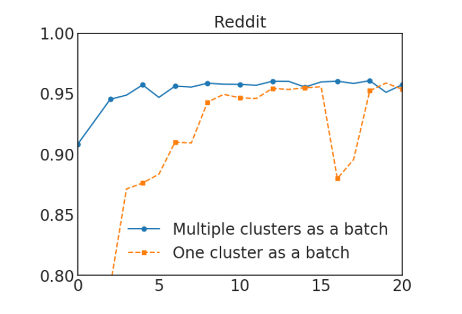
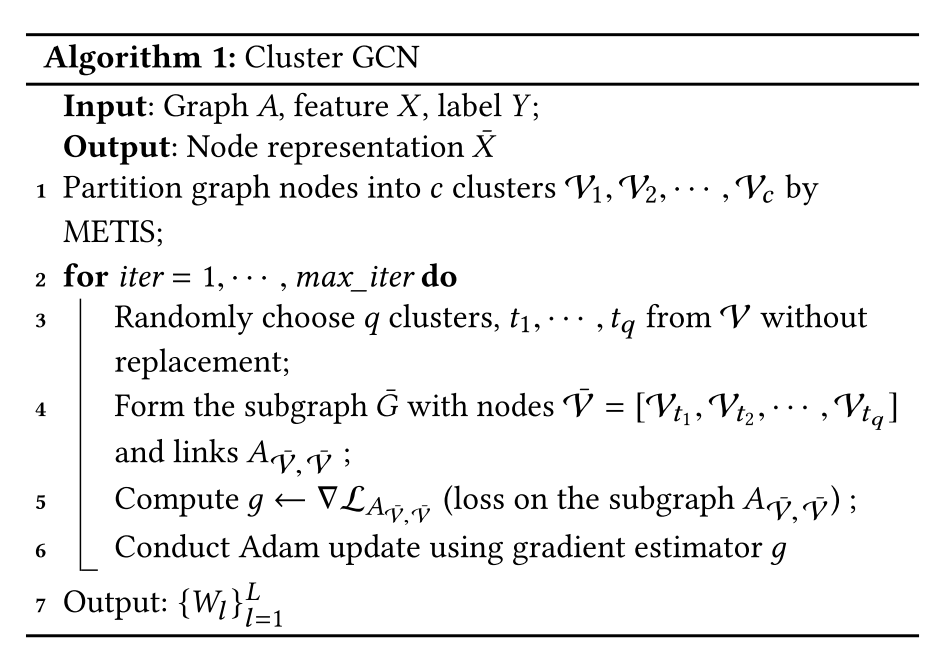

# 超大图上的节点表征学习

## 引言

图神经网络已经成功地应用于许多图节点或边的预测任务中，然而，在超大图上进行图神经网络的训练仍然具有挑战性。普通的基于SGD的图神经网络的训练方法，要么面临着**随着图神经网络层数增加计算成本呈指数增长**的问题，要么面临着**保存整个图的信息和每一层每个节点的嵌入（embedding）到GPU内存而消耗巨大内存空间**的问题。虽然一些论文已经提出了无需保存整个图的信息和每一层每个节点的嵌入（embedding）到GPU内存的方法，但它们**可能损失预测精度或者对提高内存的利用率并不显著**。于是论文[Cluster-GCN: An Efficient Algorithm for Training Deep and Large Graph Convolutional Networ](https://arxiv.org/abs/1905.07953)提出了**新的图神经网络模型，其名为Cluster-GCN，兼一种新的训练图神经网络的训练方法**。

在此篇文章中，我们将首先**对Cluster-GCN论文中提出的方法做简单概括**，接着**深入分析超大图上的节点表征学习面临的挑战**，最后**对Cluster-GCN论文中提出的方法做深入分析**。

## Cluster-GCN简单概括

为了解决普通的方法无法在超大图上做节点表征学习的问题，Cluster-GCN论文提出，利用图节点聚类算法将一个图的节点划分为$c$个簇，每一次选择几个组的节点和这些节点对应的边构成一个子图，然后对子图做训练。由于是利用图节点聚类算法将节点划分为多个簇，所以簇内边的数量要比簇间边的数量多得多。基于小图进行训练，不会消耗很多内存空间，于是我们可以训练更深的神经网络，从而得到更高的精度。

## 节点表征学习背景

给定一个图$G=(\mathcal{V}, \mathcal{E}, A)$，它由$N=|\mathcal{V}|$个节点和$|\mathcal{E}|$条边组成，其邻接矩阵记为$A$。每一个节点都关联一个$F$维的属性向量。$X \in \mathbb{R}^{N \times F}$表示$N$的特征。一个$L$层的图神经网络由$L$个图卷积层组成，每一层都通过聚合上一层的图中节点的邻居的嵌入来构建每个节点的嵌入：
$$
Z^{(l+1)}=A^{\prime} X^{(l)} W^{(l)}, X^{(l+1)}=\sigma\left(Z^{(l+1)}\right)
\tag{1}
$$
其中$X^{(l)} \in \mathbb{R}^{N \times F_{l}}$是第$l$层$N$个节点的嵌入（embedding），并且有$X^{(0)}=X$。$A^{\prime}$是归一化和规范化后的邻接矩阵，$W^{(l)} \in \mathbb{R}^{F_{l} \times F_{l+1}}$是特征转换矩阵，也就是要学习的参数。为了简单起见，我们假设所有层的特征维度都是一样的，即 $\left(F_{1}=\cdots=F_{L}=F\right)$。激活函数$\sigma(\cdot)$通常被设定为`ReLU`。

当图神经网络应用于半监督节点分类任务时，训练的目标是通过最小化损失函数来学习公式（1）中的权重矩阵：
$$
\mathcal{L}=\frac{1}{\left|\mathcal{Y}_{L}\right|} \sum_{i \in \mathcal{Y}_{L}} \operatorname{loss}\left(y_{i}, z_{i}^{L}\right)
\tag{2}
$$
其中，$y_{L}$包含所有被标记节点的标签；$z_{i}^{(L)}$是$Z^{(L)}$的第$i$行，表示节点$i$的最终预测，并且其对应真实标签为$y_{i}$。

## Cluster-GCN 详细分析

### 以往训练方法的瓶颈

以往的训练方法需要计算所有节点的嵌入以及所有（有标签）节点的损失产生的梯度（后文我们直接称为完整的梯度）。这种训练方式**需要非常巨大的计算开销和GPU内存开销**：在内存方面，通过反向传播计算（2）的全部损失的梯度**需要存储所有的嵌入矩阵**$\left\{Z^{(l)}\right\}_{l=1}^{L}$，这需要$O(N F L)$空间；在收敛速度方面，由于**神经网络在每个epoch中只更新一次**，所以训练**需要更多的epoch才能达到收敛**。

最近的一些工作证明**采用mini-batch SGD的方式训练可以提高图神经网络的训练速度并减少GPU内存需求**。在参数更新中，SGD不需要计算完整的梯度，而只需要基于mini-batch计算梯度。我们使用$\mathcal{B} \subseteq[N]$来表示一个节点索引batch，其大小为$b=|\mathcal{B}|$。SGD的每一步都将计算梯度估计值$\frac{1}{|\mathcal{B}|} \sum_{i \in \mathcal{B}} \nabla \operatorname{loss}\left(y_{i}, z_{i}^{(L)}\right)$来进行参数更新。尽管在epoches数量相同的情况下，采用SGD方式进行训练，收敛速度可以更快，但此种训练方式会**引入额外的时间开销**，这使得该训练方式相比全梯度下降的训练方式**每个epoch的时间开销要大得多**。

**为什么采用最简单的mini-batch SGD方式进行训练，每个epoch需要的时间更多？**我们将节点$i$的梯度的计算表示为$\nabla \operatorname{loss}\left(y_{i}, z_{i}^{(L)}\right)$，它依赖于节点$i$的$L$层的嵌入，而**节点$i$的非第$0$层的嵌入都依赖于各自邻居节点的前一层的嵌入**（称为领域扩展）。假设一个图神经网络有$L+1$层，每个节点的平均度数为$d$。**为了得到节点$i$的梯度，平均我们需要聚合图中$O\left(d^{L}\right)$节点的特征**。也就是说，我们需要获取节点在图中的距离为$k(k=1, \cdots, L)$的邻居节点的信息来进行一次参数更新。因为是与神经网络参数$W^{(l)}$相乘，计算任意节点嵌入的时间开销是$O\left(F^{2}\right)$。所以平均来说，**一个节点的梯度的计算需要$O\left(d^{L} F^{2}\right)$的时间**。

**节点嵌入的利用率可以反映出计算的效率。**如果一个batch有多个节点，时间复杂度就不那么简单了，因为不同的节点同样距离的邻居可以是重叠的，而计算嵌入的次数可以小于最坏的情况$O\left(b d^{L}\right)$。为了反映mini-batch SGD的计算效率，论文作者提出了**"嵌入利用率"**的概念来描述计算效率。在训练过程中，如果节点$i$在$l$层的嵌入$z_{i}^{(l)}$被计算并在$l+1$层的嵌入计算中被重复使用$u$次，那么我们说$z_{i}^{(l)}$的嵌入利用率为$u$。**对于随机抽样的mini-batch SGD，$u$非常小**，因为图通常是大而稀疏的。假设$u$是一个小常数（节点间同样距离的邻居重叠率小），那么mini-batch SGD的训练方式对每个batch的需要计算$O\left(b d^{L}\right)$量级的嵌入，于是每次参数更新需要$O\left(b d^{L} F^{2}\right)$的时间，**每个epoch需要$O\left(N d^{L} F^{2}\right)$的时间**。（这称为领域扩展问题）

相反的是，**全batch梯度下降训练具有最大的嵌入利用率**——每个嵌入将在上层被重复使用平均节点度次。因此，原来的完整梯度下降法在每个epoch中只需要计算$O(N L)$的嵌入，这意味着平均来说只需要$O(L)$的嵌入计算就可以获得一个节点的梯度。


图1：领域扩展问题说明。过去的方法和Cluster-GCN的方法之间的邻域扩展差异。红色节点是邻域节点扩展的起始节点。过去的方法受制于指数级的邻域扩展（图左），而Cluster-GCN的方法可以避免巨大范围的邻域扩展（图右）。

### 简单的Cluster-GCN

Cluster-GCN的技术是由这样的问题驱动的：在mini-batch SGD的参数更新中，我们能否设计一个将节点分成多个batch，对应地将图划分成多个计算子图，来最大化嵌入利用率？我们通过将嵌入利用率的概念与图节点聚类目标联系起来来回答这个问题是如何实现的。

考虑到在每个batch中，我们计算一组节点，记为$\mathcal{B}$，从第$1$层到第$L$层的嵌入。由于每层计算都使用相同的子图$A_{\mathcal{B}, \mathcal{B}}$（$\mathcal{B}$内的边），那么我们可以看到，嵌入利用率是这个batch中的边数，记为$\left\|A_{\mathcal{B}, \mathcal{B}}\right\|_{0}$。因此，为了最大限度地提高嵌入利用率，我们应该要设计的batch$\mathcal{B}$应该有最大的batch内的边数。通过这一点，我们将SGD参数更新的效率与图聚类算法联系起来。

现在我们正式学习Cluster-GCN。对于一个图$G$，我们将其节点划分为$c$个簇：$\mathcal{V}=\left[\mathcal{V}_{1}, \cdots \mathcal{V}_{c}\right]$，其中$\mathcal{V}_{t}$由第$t$个簇中的节点组成。因此我们有$c$个子图：
$$
\bar{G}=\left[G_{1}, \cdots, G_{c}\right]=\left[\left\{\mathcal{V}_{1}, \mathcal{E}_{1}\right\}, \cdots,\left\{\mathcal{V}_{c}, \mathcal{E}_{c}\right\}\right]
\notag
$$
其中每个$\mathcal{E}_{t}$只由$\mathcal{V}_{t}$中的节点之间的边组成。重组节点后，邻接矩阵被划分为大小为$c^{2}$的子矩阵，即
$$
A=\bar{A}+\Delta=\left[\begin{array}{ccc}
A_{11} & \cdots & A_{1 c} \\
\vdots & \ddots & \vdots \\
A_{c 1} & \cdots & A_{c c}
\end{array}\right]
\tag{4}
$$
其中
$$
\bar{A}=\left[\begin{array}{ccc}
A_{11} & \cdots & 0 \\
\vdots & \ddots & \vdots \\
0 & \cdots & A_{c c}
\end{array}\right], \Delta=\left[\begin{array}{ccc}
0 & \cdots & A_{1 c} \\
\vdots & \ddots & \vdots \\
A_{c 1} & \cdots & 0
\end{array}\right]
\tag{5}
$$
其中，对角线每个块$A_{t t}$都是大小为$\left|\mathcal{V}_{t}\right| \times\left|\mathcal{V}_{t}\right|$的邻接矩阵，它由$G_{t}$内的边构成。$\bar{A}$是图$\bar{G}$的邻接矩阵。$A_{s t}$由两个簇$\mathcal{V}_{s}$和$\mathcal{V}_{t}$之间的边构成。

$\left[Y_{1}, \cdots, Y_{c}\right]$，其中$X_{t}$和$Y_{t}$分别由$V_{t}$中节点的特征和标签组成。$\Delta$是由$A$的所有非对角线块组成的矩阵。同样，我们可以根据$\left[\mathcal{V}_{1}, \cdots, \mathcal{V}_{c}\right]$划分特征矩阵$X$和训练标签$Y$，得到$\left[X_{1}, \cdots, X_{c}\right]$和$\left[Y_{1}, \cdots, Y_{c}\right]$，其中$X_{t}$和$Y_{t}$分别由$V_{t}$中节点的特征和标签组成。

这种块对角线近似矩阵$\bar{G}$的好处是，图神经网络的目标函数变得可以分解为不同的batch。以$\bar{A}^{\prime}$表示$\bar{A}$的归一化版本，最终的嵌入矩阵成为
$$
\begin{aligned}
Z^{(L)} &=\bar{A}^{\prime} \sigma\left(\bar{A}^{\prime} \sigma\left(\cdots \sigma\left(\bar{A}^{\prime} X W^{(0)}\right) W^{(1)}\right) \cdots\right) W^{(L-1)} \\
&=\left[\begin{array}{c}
\bar{A}_{11}^{\prime} \sigma\left(\bar{A}_{11}^{\prime} \sigma\left(\cdots \sigma\left(\bar{A}_{11}^{\prime} X_{1} W^{(0)}\right) W^{(1)}\right) \cdots\right) W^{(L-1)} \\
\vdots \\
\bar{A}_{c c}^{\prime} \sigma\left(\bar{A}_{c c}^{\prime} \sigma\left(\cdots \sigma\left(\bar{A}_{c c}^{\prime} X_{c} W^{(0)}\right) W^{(1)}\right) \cdots\right) W^{(L-1)}
\end{array}\right]
\end{aligned}
\tag{6}
$$
由于$\bar{A}$的块对角形式（注意$\bar{A}_{t t}^{\prime}$是$\bar{A}^{\prime}$的相应对角块）。损失函数也可以分解为
$$
\mathcal{L}_{\bar{A}^{\prime}}=\sum_{t} \frac{\left|\mathcal{V}_{t}\right|}{N} \mathcal{L}_{\bar{A}_{t t}^{\prime}} \text { and } \mathcal{L}_{\bar{A}_{t t}^{\prime}}=\frac{1}{\left|\mathcal{V}_{t}\right|} \sum_{i \in \mathcal{V}_{t}} \operatorname{loss}\left(y_{i}, z_{i}^{(L)}\right)
\tag{7}
$$
然后，Cluster-GCN基于公式(6)和公式(7)的分解形式。在每一步参数更新，我们采样一个簇$\mathcal{V}_{t}$，然后根据$\mathcal{L}_{{\bar{A}^{\prime}}_{tt}}$的梯度进行参数更新。这种训练方式，只需要用到子图$A_{t t}$，当前batch的$X_{t}, Y_{t}$以及神经网络参数$\left\{W^{(l)}\right\}_{l=1}^{L}$。 实现起来只需要（公式(6)的一个区块的）矩阵乘积的前向和梯度反向传播。

我们使用图节点聚类算法来划分图。图节点聚类方法将图上节点分成多个簇，使簇内边远多于簇间边。这些正是我们所需要的，因为 1）如前所述，每个batch的嵌入的利用率相当于簇内边数量。直观地说，每个节点和它的邻居大部分情况下都位于同一个簇中，因此多跳后的邻居节点大概率仍然在同一个簇中。2）由于我们用块对角线近似邻接矩阵$\bar{A}$代替邻接矩阵$A$，并且误差与簇间连接$\Delta$成正比，所以我们需要找到一个分区方式，在这种分区方式下簇间连接的数量最小。

再次来看图1，我们可以看到，Cluster-GCN可以避免高代价的邻域搜索（图右），而专注于每个簇内的邻居。表2显示了两种不同的节点划分策略：随机划分与聚类划分。使用随机分区和METIS算法图被分成10个部分。然后使用一个分区作为一个batch来执行SGD参数更新。我们可以看到，在相同的epoches下，使用聚类分区可以达到更高的精度。这表明使用图聚类很重要，分区不应该随机形成。


表1：图的随机分区与聚类分区的对比（采用mini-batch SGD训练）。聚类分区得到更好的性能（就测试F1集得分而言），因为它删除了较少的分区间边。

| Dataset | random partition | clustering partition |
| :-----: | :--------------: | :------------------: |
|  Cora   |       78.4       |         82.5         |
| Pubmed  |       78.9       |         79.9         |
|   PPI   |       68.1       |         92.9         |

**时间与空间复杂度分析**

由于簇$\mathcal{V}_{t}$中每个节点只连接到该簇内部的节点，节点的邻域搜索不需要在簇外进行。每个batch的计算将纯粹是矩阵乘积$\bar{A}_{t t}^{\prime} X_{t}^{(l)} W^{(l)}$和一些元素的操作（ReLU），因此每个batch的总体时间复杂度为$O\left(\left\|A_{t t}\right\|_{0} F+ b F^{2}\right)$。因此，每个epoch的总体时间复杂度为$O\left(\|A\|_{0} F+N F^{2}\right)$。平均来说，每个batch只需要计算$O(b L)$量级的嵌入，这是线性的，而不是指数级的。在空间复杂度方面，在每个batch中，我们只需要在每层上加载 $b$个样本并存储它们的嵌入，从而产生用于存储嵌入的内存开销为$O(b L F)$。因此，我们的算法也比之前所有的算法更有内存效率。此外，我们的算法只需要将子图加载到GPU内存中，而不是全图（尽管图的存储通常不是内存瓶颈）。表1中总结了详细的时间和内存复杂度。

### 随机多分区

尽管简单Cluster-GCN实现了良好的计算和内存复杂性，但仍有两个潜在问题。

- 图被分割后，一些边（公式(4)中的$\Delta$部分）被移除。性能可能因此会受到影响。
- 图聚类算法倾向于将相似的节点聚集在一起。因此，单个簇中节点的分布可能与原始数据集不同，导致在进行SGD参数更新时对梯度的估计有偏差。

图2展示了一个标签分布不平衡的例子，该例子使用Reddit数据集，节点聚类由Metis实现。根据各个簇的标签分布来计算其熵值。与随机划分相比，我们清楚地看到大多数簇的熵值较小，表明簇的标签分布偏向于某些特定的标签。这增加了不同batch的差异，并可能影响训练的收敛性。


图2: 基于标签分布的熵值柱状图。此图展示了不同熵值的随机分区和聚类分区的分区数量，大多数聚类分区的batch具有较低的标签熵，表明每个批次内的标签分布是偏斜的。相比之下，随机分区将导致一个批次内更大的标签熵，尽管它的效率较低，正如前面所讨论的。在这个例子中，使用了Reddit数据集，进行了300个簇的分区。

为了解决上述问题，我们提出了一种随机多簇方法，来合并簇之间的边并减少各簇之间的熵值差异。我们首先将图划分为$p$簇，$\mathcal{V}_{1}, \cdots, \mathcal{V}_{p}$，$p$是一个较大的值。在构建用于SGD参数更新的batch时，我们不是只考虑一个簇，而是随机选择$q$个簇，表示为$t_{1}, \ldots, t_{q}$，得到的数据batch包含节点$\left\{\mathcal{V}_{t_{1}} \cup \cdots \cup \mathcal{V}_{t_{q}}\right\}$ 、簇内边$\left\{A_{i i} \mid i \in t_{1}, \ldots, t_{q}\right\}$和簇间边$\left\{A_{i j} \mid i, j \in t_{1}, \ldots, t_{q}\right\}$。数据batch中包含了簇间边，从而不同batch间的差异减小。

图3展示了此算法，在每个epoch中，不同的簇被选择来组成一个数据batch。在图4中，我们可以观察到，使用多个簇来组成一个batch可以提高收敛性。最终的Cluster-GCN算法在算法1中呈现。


图3：Cluster-GCN提出的随机多分区方案。在每个epoch中，我们（不放回地）随机抽取$q$个簇（本例中使用$q$=2）及其簇间的边，来构成一个新的数据batch。相同颜色的块在同一数据batch中。



图4：选择一个簇与选择多个簇的比较。前者使用300个分区。后者使用1500个簇，并随机选择5个来形成一个数据batch。该图X轴为epoches，Y轴为F1得分。



### 深层GCNs的训练问题

以前训练更深的GCN的尝试[9]似乎表明，增加更多的层是没有帮助的。然而，实验中使用的数据集可能太小，无法进行适当的论证。例如，[9]考虑的是一个只有几百个训练节点的图，对它来说，过拟合会是一个问题。此外，我们观察到深度GCN模型的优化变得很困难，因为它可能会阻碍前几层的信息被传递。在[9]中，他们采用了一种类似于残差连接的技术[6]，使模型能够将前一层的信息带到下一层。具体来说，他们修改了公式(1)，将第$l$层的隐藏表征添加到下一层，如下所示
$$
X^{(l+1)}=\sigma\left(A^{\prime} X^{(l)} W^{(l)}\right)+X^{(l)}
\tag{8}
$$
在这里，我们提出了另一种简单的技术来改善深度GCN的训练。在原始的GCN设置中，每个节点都聚合了其邻居在上一层的表示。然而，在深层GCN的设置下，该策略可能并不适合，因为它没有考虑到层数的问题。直观地说，附近的邻居应该比远处的节点贡献更大。因此，我们提出一种技术来更好地解决这个问题。这个想法是放大每个GCN层中使用的邻接矩阵$A$的对角线部分。通过这种方式，我们在每个GCN层的聚合中对来自上一层的表示赋予更多的权重。一个例子是给$\bar{A}$添加一个标识，如下所示，
$$
X^{(l+1)}=\sigma\left(\left(A^{\prime}+I\right) X^{(l)} W^{(l)}\right)
\tag{9}
$$
虽然公式(9)似乎是合理的，但对所有节点使用相同的权重而不考虑其邻居的数量可能不合适。此外，它可能会受到数值不稳定的影响，因为当使用更多的层时，数值会呈指数级增长。因此，我们提出了一个修改版的公式(9)，以更好地保持邻居信息和数值范围。我们首先给原始的$A$添加一个标识，并进行归一化处理
$$
\tilde{A}=(D+I)^{-1}(A+I)
\tag{10}
$$
然后考虑，
$$
X^{(l+1)}=\sigma\left((\tilde{A}+\lambda \operatorname{diag}(\tilde{A})) X^{(l)} W^{(l)}\right)
\tag{11}
$$

## Cluster-GCN实践

PyG为Cluster-GCN提出的训练方式和神经网络的构建提供了良好的支持。我们无需在意图节点是如何被划分成多个簇的，PyG提供的接口允许我们像训练普通神经网络一样在超大图上训练图神经网络。

### 数据集分析

```python
from torch_geometric.datasets import Reddit
from torch_geometric.data import ClusterData, ClusterLoader, NeighborSampler

dataset = Reddit('../dataset/Reddit')
data = dataset[0]
print(dataset.num_classes)
print(data.num_nodes)
print(data.num_edges)
print(data.num_features)

# 41
# 232965
# 114615873
# 602
```

可以看到该数据集包含41个分类任务，232,965个节点，114,615,873条边，节点维度为602维。

### 图节点聚类与数据加载器生成

```python
cluster_data = ClusterData(data, num_parts=1500, recursive=False, save_dir=dataset.processed_dir)
train_loader = ClusterLoader(cluster_data, batch_size=20, shuffle=True, num_workers=12)
subgraph_loader = NeighborSampler(data.edge_index, sizes=[-1], batch_size=1024, shuffle=False, num_workers=12)

```

`train_loader`，此数据加载器遵循Cluster-GCN提出的方案，图节点首先被聚类，返回的一个batch由多个簇组成。

`subgraph_loader`，使用此数据加载器不对图节点聚类，计算一个batch中的节点的嵌入需要计算该batch中的所有节点的距离从$0$到$L$的邻居节点。

### 构造图神经网络的规范

```python
class Net(torch.nn.Module):
    def __init__(self, in_channels, out_channels):
        super(Net, self).__init__()
        self.convs = ModuleList(
            [SAGEConv(in_channels, 128),
             SAGEConv(128, out_channels)])

    def forward(self, x, edge_index):
        for i, conv in enumerate(self.convs):
            x = conv(x, edge_index)
            if i != len(self.convs) - 1:
                x = F.relu(x)
                x = F.dropout(x, p=0.5, training=self.training)
        return F.log_softmax(x, dim=-1)

    def inference(self, x_all):
        pbar = tqdm(total=x_all.size(0) * len(self.convs))
        pbar.set_description('Evaluating')

        # Compute representations of nodes layer by layer, using *all*
        # available edges. This leads to faster computation in contrast to
        # immediately computing the final representations of each batch.
        for i, conv in enumerate(self.convs):
            xs = []
            for batch_size, n_id, adj in subgraph_loader:
                edge_index, _, size = adj.to(device)
                x = x_all[n_id].to(device)
                x_target = x[:size[1]]
                x = conv((x, x_target), edge_index)
                if i != len(self.convs) - 1:
                    x = F.relu(x)
                xs.append(x.cpu())

                pbar.update(batch_size)

            x_all = torch.cat(xs, dim=0)

        pbar.close()

        return x_all

```

可以看到此神经网络拥有`forward`和`inference`两个方法。`forward`函数的定义与普通的图神经网络并无区别。`inference`方法应用于推理阶段，为了获取更高的预测精度，所有使用`subgraph_loader`。

### 训练、验证与测试

```python
device = torch.device('cuda' if torch.cuda.is_available() else 'cpu')
model = Net(dataset.num_features, dataset.num_classes).to(device)
optimizer = torch.optim.Adam(model.parameters(), lr=0.005)

def train():
    model.train()

    total_loss = total_nodes = 0
    for batch in train_loader:
        batch = batch.to(device)
        optimizer.zero_grad()
        out = model(batch.x, batch.edge_index)
        loss = F.nll_loss(out[batch.train_mask], batch.y[batch.train_mask])
        loss.backward()
        optimizer.step()

        nodes = batch.train_mask.sum().item()
        total_loss += loss.item() * nodes
        total_nodes += nodes

    return total_loss / total_nodes


@torch.no_grad()
def test():  # Inference should be performed on the full graph.
    model.eval()

    out = model.inference(data.x)
    y_pred = out.argmax(dim=-1)

    accs = []
    for mask in [data.train_mask, data.val_mask, data.test_mask]:
        correct = y_pred[mask].eq(data.y[mask]).sum().item()
        accs.append(correct / mask.sum().item())
    return accs


for epoch in range(1, 31):
    loss = train()
    if epoch % 5 == 0:
        train_acc, val_acc, test_acc = test()
        print(f'Epoch: {epoch:02d}, Loss: {loss:.4f}, Train: {train_acc:.4f}, '
              f'Val: {val_acc:.4f}, test: {test_acc:.4f}')
    else:
        print(f'Epoch: {epoch:02d}, Loss: {loss:.4f}')

```

可见在训练过程中，我们从`train_loader`获取batch，每次只根据一个batch进行参数训练。但在测试节点，我们不做图节点聚类，因此不会有边丢失的情况。

### 完整代码

可见于`codes/cluster_gcn.py`。

## 结语

在此篇文章中，我们学习了超大图上的节点表征学习面临的挑战，然后学习了应对这一挑战的Cluster-GCN提出的方法，在实践部分我们还学习了使用Cluster-GCN提出的方案进行超大图节点分类的方法，以及图神经网络的设计规范。

