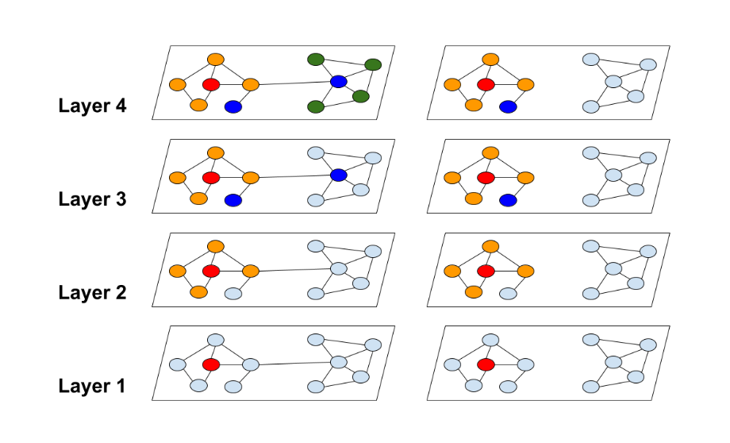
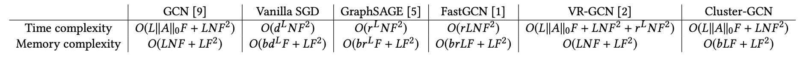
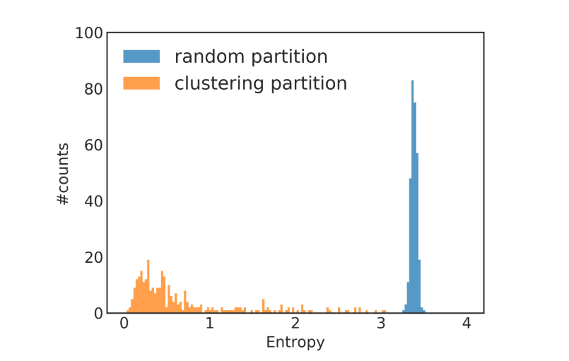
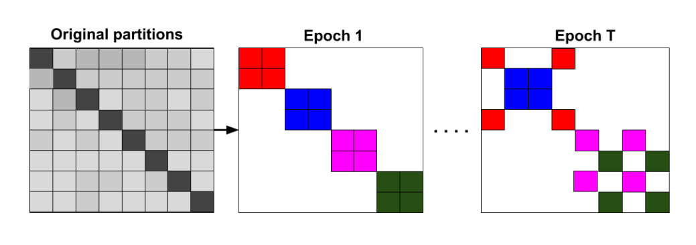

# 超大图上的节点表征学习

**注：此节文章翻译并整理自提出Cluster-GCN的论文：[Cluster-GCN: An Efficient Algorithm for Training Deep and Large Graph Convolutional Network](https://arxiv.org/abs/1905.07953)**

## 引言

图神经网络已经成功地应用于许多节点或边的预测任务，然而，在超大图上进行图神经网络的训练仍然具有挑战。普通的基于SGD的图神经网络的训练方法，要么面临着**随着图神经网络层数增加，计算成本呈指数增长**的问题，要么面临着**保存整个图的信息和每一层每个节点的表征到内存（显存）而消耗巨大内存（显存）空间**的问题。虽然已经有一些论文提出了无需保存整个图的信息和每一层每个节点的表征到GPU内存（显存）的方法，但这些方法**可能会损失预测精度**或者**对提高内存的利用率并不明显**。于是论文[Cluster-GCN: An Efficient Algorithm for Training Deep and Large Graph Convolutional Network](https://arxiv.org/abs/1905.07953)提出了**一种新的图神经网络的训练方法**。

在此篇文章中，我们将首先**对Cluster-GCN论文中提出的方法（后文中简称为Cluster-GCN方法）做简单概括**，接着**深入分析超大图上的节点表征学习面临的挑战**，最后**对Cluster-GCN方法做深入分析**。

## Cluster-GCN方法简单概括

为了解决**普通训练方法无法训练超大图**的问题，Cluster-GCN论文提出：

- 利用图节点聚类算法将一个图的节点划分为$c$个簇，每一次选择几个簇的节点和这些节点对应的边构成一个子图，然后对子图做训练。
- 由于是利用图节点聚类算法将节点划分为多个簇，所以簇内边的数量要比簇间边的数量多得多，所以可以提高表征利用率，并提高图神经网络的训练效率。
- 每一次随机选择多个簇来组成一个batch，这样不会丢失簇间的边，同时也不会有batch内类别分布偏差过大的问题。
- 基于小图进行训练，不会消耗很多内存空间，于是我们可以训练更深的神经网络，进而可以达到更高的精度。

## 节点表征学习回顾

给定一个图$G=(\mathcal{V}, \mathcal{E}, A)$，它由$N=|\mathcal{V}|$个节点和$|\mathcal{E}|$条边组成，其邻接矩阵记为$A$，其节点属性记为$X \in \mathbb{R}^{N \times F}$，$F$表示节点属性的维度。一个$L$层的图卷积神经网络由$L$个图卷积层组成，每一层都通过聚合邻接节点的上一层的表征来生成中心节点的当前层的表征：
$$
Z^{(l+1)}=A^{\prime} X^{(l)} W^{(l)}, X^{(l+1)}=\sigma\left(Z^{(l+1)}\right)
\tag{1}
$$
其中$X^{(l)} \in \mathbb{R}^{N \times F_{l}}$表示第$l$层$N$个节点的表征，并且有$X^{(0)}=X$。$A^{\prime}$是归一化和规范化后的邻接矩阵，$W^{(l)} \in \mathbb{R}^{F_{l} \times F_{l+1}}$是权重矩阵，也就是要训练的参数。为了简单起见，我们假设所有层的表征维度都是一样的，即 $\left(F_{1}=\cdots=F_{L}=F\right)$。激活函数$\sigma(\cdot)$通常被设定为`ReLU`。

当图神经网络应用于半监督节点分类任务时，训练的目标是通过最小化损失函数来学习公式(1)中的权重矩阵：
$$
\mathcal{L}=\frac{1}{\left|\mathcal{Y}_{L}\right|} \sum_{i \in \mathcal{Y}_{L}} \operatorname{loss}\left(y_{i}, z_{i}^{L}\right)
\tag{2}
$$
其中，$\mathcal{Y}_{L}$是节点类别；$z_{i}^{(L)}$是$Z^{(L)}$的第$i$行，表示对节点$i$的预测，节点$i$的真实类别为$y_{i}$。

## Cluster-GCN方法详细分析

### 以往训练方法的瓶颈

以往的训练方法需要同时计算所有节点的表征以及训练集中所有节点的损失产生的梯度（后文我们直接称为完整梯度）。这种训练方式**需要非常巨大的计算开销和内存（显存）开销**：在内存（显存）方面，计算公式(2)的完整梯度**需要存储所有的节点表征矩阵**$\left\{Z^{(l)}\right\}_{l=1}^{L}$，这需要$O(N F L)$的空间；在收敛速度方面，由于**神经网络在每个epoch中只更新一次**，所以训练**需要更多的epoch才能达到收敛**。

最近的一些工作证明，**采用mini-batch SGD的方式训练，可以提高图神经网络的训练速度并减少内存（显存）需求**。在参数更新中，SGD不需要计算完整梯度，而只需要基于mini-batch计算部分梯度。我们使用$\mathcal{B} \subseteq[N]$来表示一个batch，其大小为$b=|\mathcal{B}|$。SGD的每一步都将计算梯度估计值$\frac{1}{|\mathcal{B}|} \sum_{i \in \mathcal{B}} \nabla \operatorname{loss}\left(y_{i}, z_{i}^{(L)}\right)$来进行参数更新。尽管在epoches数量相同的情况下，采用SGD方式进行训练，收敛速度可以更快，但此种训练方式会**引入额外的时间开销**，这使得相比于全梯度下降的训练方式，此种训练方式**每个epoch的时间开销要大得多**。

**为什么采用最简单的mini-batch SGD方式进行训练，每个epoch需要的时间更多？**我们将节点$i$的梯度的计算表示为$\nabla \operatorname{loss}\left(y_{i}, z_{i}^{(L)}\right)$，它依赖于节点$i$的$L$层的表征，而**节点$i$的非第$0$层的表征都依赖于各自邻接节点的前一层的表征**，这被称为**邻域扩展**。假设一个图神经网络有$L+1$层，节点的平均的度为$d$。**为了得到节点$i$的梯度，平均我们需要聚合图上$O\left(d^{L}\right)$的节点的表征**。也就是说，我们需要获取节点的距离为$k(k=1, \cdots, L)$的邻接节点的信息来进行一次参数更新。由于要与权重矩阵$W^{(l)}$相乘，所以计算任意节点表征的时间开销是$O\left(F^{2}\right)$。所以平均来说，**一个节点的梯度的计算需要$O\left(d^{L} F^{2}\right)$的时间**。

**节点表征的利用率可以反映出计算的效率。**考虑到一个batch有多个节点，时间与空间复杂度的计算就不是上面那样简单了，因为不同的节点同样距离远的邻接节点可以是重叠的，于是计算表征的次数可以小于最坏的情况$O\left(b d^{L}\right)$。为了反映mini-batch SGD的计算效率，Cluster-GCN论文提出了**"表征利用率"**的概念来描述计算效率。在训练过程中，如果节点$i$在$l$层的表征$z_{i}^{(l)}$被计算并在$l+1$层的表征计算中被重复使用$u$次，那么我们说$z_{i}^{(l)}$的表征利用率为$u$。**对于随机抽样的mini-batch SGD，$u$非常小**，因为图通常是大且稀疏的。假设$u$是一个小常数（节点间同样距离的邻接节点重叠率小），那么mini-batch SGD的训练方式对每个batch需要计算$O\left(b d^{L}\right)$的表征，于是每次参数更新需要$O\left(b d^{L} F^{2}\right)$的时间，**每个epoch需要$O\left(N d^{L} F^{2}\right)$的时间**，这被称为**邻域扩展问题**。

相反的是，**全梯度下降训练具有最大的表征利用率**——每个节点表征将在上一层被重复使用平均节点度次。因此，全梯度下降法在每个epoch中只需要计算$O(N L)$的表征，这意味着平均下来只需要$O(L)$的表征计算就可以获得一个节点的梯度。



图1 - **邻域扩展问题说明**：过去的方法和Cluster-GCN方法之间的邻域扩展差异。红色节点是邻域扩展的起始节点。过去的方法需要做指数级的邻域扩展（图左），而Cluster-GCN的方法可以避免巨大范围的邻域扩展（图右）。

### 简单的Cluster-GCN方法

**Cluster-GCN方法是由这样的问题驱动的**：我们能否找到一种将节点分成多个batch的方式，对应地将图划分成多个子图，使得表征利用率最大？我们通过**将表征利用率的概念与图节点聚类的目标联系起来**来回答这个问题。

考虑到在每个batch中，我们计算一组节点（记为$\mathcal{B}$）从第$1$层到第$L$层的表征。由于图神经网络每一层的计算都使用相同的子图$A_{\mathcal{B}, \mathcal{B}}$（$\mathcal{B}$内部的边），所以表征利用率就是这个batch内边的数量，记为$\left\|A_{\mathcal{B}, \mathcal{B}}\right\|_{0}$。因此，**为了最大限度地提高表征利用率，理想的划分batch的结果是，batch内的边尽可能多，batch之间的边尽可能少**。基于这一点，我们将SGD图神经网络训练的效率与图聚类算法联系起来。

**现在我们正式学习Cluster-GCN方法**。对于一个图$G$，我们将其节点划分为$c$个簇：$\mathcal{V}=\left[\mathcal{V}_{1}, \cdots \mathcal{V}_{c}\right]$，其中$\mathcal{V}_{t}$由第$t$个簇中的节点组成，对应的我们有$c$个子图：
$$
\bar{G}=\left[G_{1}, \cdots, G_{c}\right]=\left[\left\{\mathcal{V}_{1}, \mathcal{E}_{1}\right\}, \cdots,\left\{\mathcal{V}_{c}, \mathcal{E}_{c}\right\}\right]
\notag
$$
其中$\mathcal{E}_{t}$只由$\mathcal{V}_{t}$中的节点之间的边组成。经过节点重组，邻接矩阵被划分为大小为$c^{2}$的块矩阵，如下所示
$$
A=\bar{A}+\Delta=\left[\begin{array}{ccc}
A_{11} & \cdots & A_{1 c} \\
\vdots & \ddots & \vdots \\
A_{c 1} & \cdots & A_{c c}
\end{array}\right]
\tag{4}
$$
其中
$$
\bar{A}=\left[\begin{array}{ccc}
A_{11} & \cdots & 0 \\
\vdots & \ddots & \vdots \\
0 & \cdots & A_{c c}
\end{array}\right], \Delta=\left[\begin{array}{ccc}
0 & \cdots & A_{1 c} \\
\vdots & \ddots & \vdots \\
A_{c 1} & \cdots & 0
\end{array}\right]
\tag{5}
$$
其中，对角线上的块$A_{t t}$是大小为$\left|\mathcal{V}_{t}\right| \times\left|\mathcal{V}_{t}\right|$的邻接矩阵，它由$G_{t}$内部的边构成。$\bar{A}$是图$\bar{G}$的邻接矩阵。$A_{s t}$由两个簇$\mathcal{V}_{s}$和$\mathcal{V}_{t}$之间的边构成。$\Delta$是由$A$的所有非对角线块组成的矩阵。同样，我们可以根据$\left[\mathcal{V}_{1}, \cdots, \mathcal{V}_{c}\right]$划分节点表征矩阵$X$和类别向量$Y$，得到$\left[X_{1}, \cdots, X_{c}\right]$和$\left[Y_{1}, \cdots, Y_{c}\right]$，其中$X_{t}$和$Y_{t}$分别由$V_{t}$中节点的表征和类别组成。

接下来我们**用块对角线邻接矩阵$\bar{A}$去近似邻接矩阵$A$**，这样做的好处是，**完整的损失函数（公示(2）)可以根据batch分解成多个部分之和**。以$\bar{A}^{\prime}$表示归一化后的$\bar{A}$，最后一层节点表征矩阵可以做如下的分解：
$$
\begin{aligned}
Z^{(L)} &=\bar{A}^{\prime} \sigma\left(\bar{A}^{\prime} \sigma\left(\cdots \sigma\left(\bar{A}^{\prime} X W^{(0)}\right) W^{(1)}\right) \cdots\right) W^{(L-1)} \\
&=\left[\begin{array}{c}
\bar{A}_{11}^{\prime} \sigma\left(\bar{A}_{11}^{\prime} \sigma\left(\cdots \sigma\left(\bar{A}_{11}^{\prime} X_{1} W^{(0)}\right) W^{(1)}\right) \cdots\right) W^{(L-1)} \\
\vdots \\
\bar{A}_{c c}^{\prime} \sigma\left(\bar{A}_{c c}^{\prime} \sigma\left(\cdots \sigma\left(\bar{A}_{c c}^{\prime} X_{c} W^{(0)}\right) W^{(1)}\right) \cdots\right) W^{(L-1)}
\end{array}\right]
\end{aligned}
\tag{6}
$$
由于$\bar{A}$是块对角形式（$\bar{A}_{t t}^{\prime}$是$\bar{A}^{\prime}$的对角线上的块），于是损失函数可以分解为
$$
\mathcal{L}_{\bar{A}^{\prime}}=\sum_{t} \frac{\left|\mathcal{V}_{t}\right|}{N} \mathcal{L}_{\bar{A}_{t t}^{\prime}} \text { and } \mathcal{L}_{\bar{A}_{t t}^{\prime}}=\frac{1}{\left|\mathcal{V}_{t}\right|} \sum_{i \in \mathcal{V}_{t}} \operatorname{loss}\left(y_{i}, z_{i}^{(L)}\right)
\tag{7}
$$
基于公式(6)和公式(7)，在训练的每一步中，Cluster-GCN首先**采样一个簇$\mathcal{V}_{t}$**，然后**根据$\mathcal{L}_{{\bar{A}^{\prime}}_{tt}}$的梯度进行参数更新**。这种训练方式，只需要用到子图$A_{t t}$, $X_{t}$, $Y_{t}$以及神经网络权重矩阵$\left\{W^{(l)}\right\}_{l=1}^{L}$。 实际中，主要的计算开销在神经网络前向过程中的矩阵乘法运算（公式(6)的一个行）和梯度反向传播。

我们使用图节点聚类算法来划分图。**图节点聚类算法将图节点分成多个簇，划分结果是簇内边的数量远多于簇间边的数量**。如前所述，每个batch的表征利用率相当于簇内边的数量。直观地说，每个节点和它的邻接节点大部分情况下都位于同一个簇中，因此**$L$跳（L-hop）远的邻接节点大概率仍然在同一个簇中**。由于我们用块对角线近似邻接矩阵$\bar{A}$代替邻接矩阵$A$，产生的误差与簇间的边的数量$\Delta$成正比，所以**簇间的边越少越好**。综上所述，使用图节点聚类算法对图节点划分多个簇的结果，正是我们希望得到的。

再次来看图1，我们可以看到，**Cluster-GCN方法可以避免巨大范围的邻域扩展**（图右），因为Cluster-GCN方法将邻域扩展限制在簇内。


表1显示了两种不同的节点划分策略：随机划分与聚类划分。两者都使用一个分区作为一个batch来进行神经网络训练。我们可以看到，在相同的epoches下，使用聚类分区可以达到更高的精度。

表1：随机分区与聚类分区的对比（采用mini-batch SGD训练）。聚类分区得到更好的性能（就测试F1集得分而言），因为它删除的分区间的边较少。

| Dataset | random partition | clustering partition |
| :-----: | :--------------: | :------------------: |
|  Cora   |       78.4       |         82.5         |
| Pubmed  |       78.9       |         79.9         |
|   PPI   |       68.1       |         92.9         |

**时间与空间复杂度分析**

由于簇$\mathcal{V}_{t}$中每个节点只连接到该簇内部的节点，节点的邻域扩展不需要在簇外进行。每个batch的计算将纯粹是矩阵乘积运算（$\bar{A}_{t t}^{\prime} X_{t}^{(l)} W^{(l)}$）和一些对元素的操作（ReLU），因此每个batch的总体时间复杂度为$O\left(\left\|A_{t t}\right\|_{0} F+ b F^{2}\right)$。因此，每个epoch的总体时间复杂度为$O\left(\|A\|_{0} F+N F^{2}\right)$。平均来说，每个batch只需要计算$O(b L)$的表征，这是线性的，而不是指数级的。在空间复杂度方面，在每个batch中，我们只需要在每一层中存储$b$个节点的表征，产生用于存储表征的内存（显存）开销为$O(b L F)$。因此，此算法也比之前所有的算法的内存效率更高。此外，我们的算法只需加载子图到内存（显存）中，而不是完整的图（尽管图的存储通常不是内存瓶颈）。表2中总结了详细的时间和内存复杂度。

表2：时间和空间复杂性



### 随机多分区

尽管简单Cluster-GCN方法可以做到较其他方法更低的计算和内存复杂度，但它仍存在两个潜在问题：

- **图被分割后，一些边（公式(4)中的$\Delta$部分）被移除，性能可能因此会受到影响。**
- **图聚类算法倾向于将相似的节点聚集在一起。因此，单个簇中节点的类别分布可能与原始数据集不同，导致对梯度的估计有偏差。**

图2展示了一个类别分布不平衡的例子，该例子使用Reddit数据集，节点聚类由Metis软件包实现。根据各个簇的类别分布来计算熵值。与随机划分相比，采用聚类划分得到的大多数簇熵值都很小，**簇熵值小表明簇中节点的标签分布偏向于某一些类别**，这意味着不同簇的标签分布有较大的差异，这将影响训练的收敛。



图2：类别分布熵值柱状图。类别分布熵越高意味着簇内类别分布越平衡，反之意味着簇内类别分布越不平衡。此图展示了不同熵值的随机分区和聚类分区的簇的数量，大多数聚类分区的簇具有较低的熵，表明各个簇内节点的类别分布存在偏差。相比之下，随机分区会产生类别分布熵很高的簇，尽管基于随机分区的训练的效率较低。在这个例子中，使用了Reddit数据集，进行了300个簇的分区。

为了解决上述问题，Cluster-GCN论文提出了一种**随机多簇方法**，此方法首先将图划分为$p$个簇，$\mathcal{V}_{1}, \cdots, \mathcal{V}_{p}$，$p$是一个较大的值，在构建一个batch时，不是只使用一个簇，而是使用随机选择的$q$个簇，表示为$t_{1}, \ldots, t_{q}$，得到的batch包含节点$\left\{\mathcal{V}_{t_{1}} \cup \cdots \cup \mathcal{V}_{t_{q}}\right\}$ 、簇内边$\left\{A_{i i} \mid i \in t_{1}, \ldots, t_{q}\right\}$和簇间边$\left\{A_{i j} \mid i, j \in t_{1}, \ldots, t_{q}\right\}$。此方法的好处有，1）不会丢失簇间的边，2）不会有很大的batch内类别分布的偏差，3）以及不同的epoch使用的batch不同，这可以降低梯度估计的偏差。

图3展示了随机多簇方法，在每个epoch中，随机选择一些簇来组成一个batch，不同的epoch的batch不同。在图4中，我们可以观察到，使用多个簇来组成一个batch可以提高收敛性。最终的Cluster-GCN算法在算法1中呈现。



图3：Cluster-GCN提出的随机多分区方法。在每个epoch中，我们（不放回地）随机抽取$q$个簇（本例中使用$q$=2）及其簇间的边，来构成一个batch（相同颜色的块在同一batch中）。


图4：选择一个簇与选择多个簇的比较。前者使用300个簇。后者使用1500个簇，并随机选择5个簇来组成一个batch。该图X轴为epoches，Y轴为F1得分。


### 训练深层GCNs的问题

以往尝试训练更深的GCN的研究似乎表明，增加更多的层是没有帮助的。然而，那些研究的实验使用的图太小，所以结论可能并不正确。例如，其中有一项研究只使用了一个只有几百个训练节点的图，由于节点数量过少，很容易出现过拟合的问题。此外，加深GCN神经网络层数后，训练变得很困难，因为层数多了之后前面的信息可能无法传到后面。有的研究采用了一种类似于残差连接的技术，使模型能够将前一层的信息直接传到下一层。具体来说，他们修改了公式(1)，将第$l$层的表征添加到下一层，如下所示
$$
X^{(l+1)}=\sigma\left(A^{\prime} X^{(l)} W^{(l)}\right)+X^{(l)}
\tag{8}
$$
在这里，我们提出了另一种简单的技术来改善深层GCN神经网络的训练。在原始的GCN的设置里，每个节点都聚合邻接节点在上一层的表征。然而，在深层GCN的设置里，该策略可能不适合，因为它没有考虑到层数的问题。直观地说，近距离的邻接节点应该比远距离的的邻接节点贡献更大。因此，Cluster-GCN提出一种技术来更好地解决这个问题。其主要思想是放大GCN每一层中使用的邻接矩阵$A$的对角线部分。通过这种方式，我们在GCN的每一层的聚合中对来自上一层的表征赋予更大的权重。这可以通过给$\bar{A}$加上一个单位矩阵$I$来实现，如下所示，
$$
X^{(l+1)}=\sigma\left(\left(A^{\prime}+I\right) X^{(l)} W^{(l)}\right)
\tag{9}
$$
虽然公式(9)似乎是合理的，但对所有节点使用相同的权重而不考虑其邻居的数量可能不合适。此外，它可能会受到数值不稳定的影响，因为当使用更多的层时，数值会呈指数级增长。因此，Cluster-GCN方法提出了一个修改版的公式(9)，以更好地保持邻接节点信息和数值范围。首先给原始的$A$添加一个单位矩阵$I$，并进行归一化处理
$$
\tilde{A}=(D+I)^{-1}(A+I)
\tag{10}
$$
然后考虑，
$$
X^{(l+1)}=\sigma\left((\tilde{A}+\lambda \operatorname{diag}(\tilde{A})) X^{(l)} W^{(l)}\right)
\tag{11}
$$

## Cluster-GCN实践

**PyG为Cluster-GCN提出的训练方式和神经网络的构建提供了良好的支持**。我们无需在意图节点是如何被划分成多个簇的，PyG提供的接口允许我们像训练普通神经网络一样在超大图上训练图神经网络。

### 数据集分析

```python
from torch_geometric.datasets import Reddit
from torch_geometric.data import ClusterData, ClusterLoader, NeighborSampler

dataset = Reddit('../dataset/Reddit')
data = dataset[0]
print(dataset.num_classes)
print(data.num_nodes)
print(data.num_edges)
print(data.num_features)

# 41
# 232965
# 114615873
# 602
```

可以看到该数据集包含41个分类任务，232,965个节点，114,615,873条边，节点维度为602维。

### 图节点聚类与数据加载器生成

```python
cluster_data = ClusterData(data, num_parts=1500, recursive=False, save_dir=dataset.processed_dir)
train_loader = ClusterLoader(cluster_data, batch_size=20, shuffle=True, num_workers=12)
subgraph_loader = NeighborSampler(data.edge_index, sizes=[-1], batch_size=1024, shuffle=False, num_workers=12)

```

`train_loader`，此数据加载器遵循Cluster-GCN提出的方法，图节点被聚类划分成多个簇，此数据加载器返回的一个batch由多个簇组成。

`subgraph_loader`，使用此数据加载器不对图节点聚类，计算一个batch中的节点的表征需要计算该batch中的所有节点的距离从$0$到$L$的邻居节点。

### 图神经网络的构建

```python
class Net(torch.nn.Module):
    def __init__(self, in_channels, out_channels):
        super(Net, self).__init__()
        self.convs = ModuleList(
            [SAGEConv(in_channels, 128),
             SAGEConv(128, out_channels)])

    def forward(self, x, edge_index):
        for i, conv in enumerate(self.convs):
            x = conv(x, edge_index)
            if i != len(self.convs) - 1:
                x = F.relu(x)
                x = F.dropout(x, p=0.5, training=self.training)
        return F.log_softmax(x, dim=-1)

    def inference(self, x_all):
        pbar = tqdm(total=x_all.size(0) * len(self.convs))
        pbar.set_description('Evaluating')

        # Compute representations of nodes layer by layer, using *all*
        # available edges. This leads to faster computation in contrast to
        # immediately computing the final representations of each batch.
        for i, conv in enumerate(self.convs):
            xs = []
            for batch_size, n_id, adj in subgraph_loader:
                edge_index, _, size = adj.to(device)
                x = x_all[n_id].to(device)
                x_target = x[:size[1]]
                x = conv((x, x_target), edge_index)
                if i != len(self.convs) - 1:
                    x = F.relu(x)
                xs.append(x.cpu())

                pbar.update(batch_size)

            x_all = torch.cat(xs, dim=0)

        pbar.close()

        return x_all

```

可以看到此神经网络拥有`forward`和`inference`两个方法。`forward`函数的定义与普通的图神经网络并无区别。`inference`方法应用于推理阶段，为了获取更高的预测精度，所以使用`subgraph_loader`。

### 训练、验证与测试

```python
device = torch.device('cuda' if torch.cuda.is_available() else 'cpu')
model = Net(dataset.num_features, dataset.num_classes).to(device)
optimizer = torch.optim.Adam(model.parameters(), lr=0.005)

def train():
    model.train()

    total_loss = total_nodes = 0
    for batch in train_loader:
        batch = batch.to(device)
        optimizer.zero_grad()
        out = model(batch.x, batch.edge_index)
        loss = F.nll_loss(out[batch.train_mask], batch.y[batch.train_mask])
        loss.backward()
        optimizer.step()

        nodes = batch.train_mask.sum().item()
        total_loss += loss.item() * nodes
        total_nodes += nodes

    return total_loss / total_nodes


@torch.no_grad()
def test():  # Inference should be performed on the full graph.
    model.eval()

    out = model.inference(data.x)
    y_pred = out.argmax(dim=-1)

    accs = []
    for mask in [data.train_mask, data.val_mask, data.test_mask]:
        correct = y_pred[mask].eq(data.y[mask]).sum().item()
        accs.append(correct / mask.sum().item())
    return accs


for epoch in range(1, 31):
    loss = train()
    if epoch % 5 == 0:
        train_acc, val_acc, test_acc = test()
        print(f'Epoch: {epoch:02d}, Loss: {loss:.4f}, Train: {train_acc:.4f}, '
              f'Val: {val_acc:.4f}, test: {test_acc:.4f}')
    else:
        print(f'Epoch: {epoch:02d}, Loss: {loss:.4f}')

```

可见在训练过程中，我们使用`train_loader`获取batch，每次根据多个簇组成的batch进行神经网络的训练。但在验证阶段，我们使用`subgraph_loader`，在计算一个节点的表征时会计算该节点的距离从$0$到$L$的邻接节点，这么做可以更好地测试神经网络的性能。

### 完整代码

可见于`codes/cluster_gcn.py`。

## 结语

在此篇文章中，我们学习了超大图上的节点表征学习面临的挑战，然后学习了应对这一挑战的Cluster-GCN方法，在实践部分我们还学习了使用Cluster-GCN方法进行超大图节点分类的方法。

## 作业

- 尝试将数据集切分成不同数量的簇进行实验，然后观察结果并进行比较。

## 参考资料

- 提出Cluster-GCN的论文：[Cluster-GCN: An Efficient Algorithm for Training Deep and Large Graph Convolutional Network](https://arxiv.org/abs/1905.07953)
- [9]: Thomas N. Kipf and Max Welling. 2017. Semi-Supervised Classification with Graph Convolutional Networks. In ICLR.

