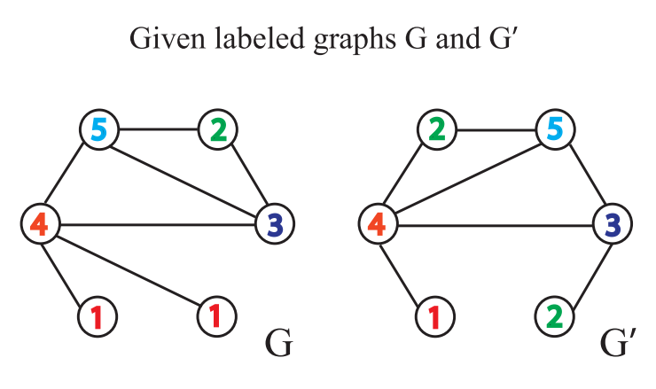
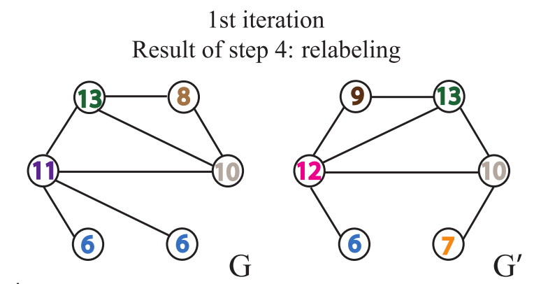

# 基于图神经网络的图表征学习方法

## 引言

在此篇文章中我们将学习**基于图神经网络的图表征学习方法**，图表征学习要求在输入节点属性、边和边的属性（如果有的话）得到一个向量作为图的表征，基于图表征进一步的我们可以做图的预测。基于图同构网络（Graph Isomorphism Network, GIN）的图表征网络是当前最经典的图表征学习网络，我们将以它为例，**通过该网络的实现、项目实践和理论分析，三个层面来学习基于图神经网络的图表征学习方法**。

**提出图同构网络的论文：[How Powerful are Graph Neural Networks? ](https://arxiv.org/abs/1810.00826)**

## 基于图同构网络（GIN）的图表征网络的实现

**基于图同构网络的图表征学习主要包含以下两个过程**：

1. **首先计算得到节点表征；**
2. **其次对图上各个节点的表征做图池化（Graph Pooling），或称为图读出（Graph Readout），得到图的表征（Graph Representation）。**

在此文中，我们将**采用自顶向下的方式，来学习基于图同构模型（GIN）的图表征学习方法**。我们**首先关注如何基于节点表征计算得到图的表征，而忽略计算结点表征的方法**。

### 基于图同构网络的图表征模块（GINGraphRepr Module）

此模块首先采用`GINNodeEmbedding`模块对图上每一个节点做节点嵌入（Node Embedding），得到节点表征；然后对节点表征做图池化得到图的表征；最后用一层线性变换对图表征转换为对图的预测。代码实现如下：

```python
import torch
from torch import nn
from torch_geometric.nn import global_add_pool, global_mean_pool, global_max_pool, GlobalAttention, Set2Set
from gin_node import GINNodeEmbedding

class GINGraphRepr(nn.Module):

    def __init__(self, num_tasks=1, num_layers=5, emb_dim=300, residual=False, drop_ratio=0, JK="last", graph_pooling="sum"):
        """GIN Graph Pooling Module
        Args:
            num_tasks (int, optional): number of labels to be predicted. Defaults to 1 (控制了图表征的维度，dimension of graph representation).
            num_layers (int, optional): number of GINConv layers. Defaults to 5.
            emb_dim (int, optional): dimension of node embedding. Defaults to 300.
            residual (bool, optional): adding residual connection or not. Defaults to False.
            drop_ratio (float, optional): dropout rate. Defaults to 0.
            JK (str, optional): 可选的值为"last"和"sum"。选"last"，只取最后一层的结点的嵌入，选"sum"对各层的结点的嵌入求和。Defaults to "last".
            graph_pooling (str, optional): pooling method of node embedding. 可选的值为"sum"，"mean"，"max"，"attention"和"set2set"。 Defaults to "sum".

        Out:
            graph representation
        """
        super(GINGraphPooling, self).__init__()

        self.num_layers = num_layers
        self.drop_ratio = drop_ratio
        self.JK = JK
        self.emb_dim = emb_dim
        self.num_tasks = num_tasks

        if self.num_layers < 2:
            raise ValueError("Number of GNN layers must be greater than 1.")

        self.gnn_node = GINNodeEmbedding(num_layers, emb_dim, JK=JK, drop_ratio=drop_ratio, residual=residual)

        # Pooling function to generate whole-graph embeddings
        if graph_pooling == "sum":
            self.pool = global_add_pool
        elif graph_pooling == "mean":
            self.pool = global_mean_pool
        elif graph_pooling == "max":
            self.pool = global_max_pool
        elif graph_pooling == "attention":
            self.pool = GlobalAttention(gate_nn=nn.Sequential(
                nn.Linear(emb_dim, emb_dim), nn.BatchNorm1d(emb_dim), nn.ReLU(), nn.Linear(emb_dim, 1)))
        elif graph_pooling == "set2set":
            self.pool = Set2Set(emb_dim, processing_steps=2)
        else:
            raise ValueError("Invalid graph pooling type.")

        if graph_pooling == "set2set":
            self.graph_pred_linear = nn.Linear(2*self.emb_dim, self.num_tasks)
        else:
            self.graph_pred_linear = nn.Linear(self.emb_dim, self.num_tasks)

    def forward(self, batched_data):
        h_node = self.gnn_node(batched_data)

        h_graph = self.pool(h_node, batched_data.batch)
        output = self.graph_pred_linear(h_graph)

        if self.training:
            return output
        else:
            # At inference time, relu is applied to output to ensure positivity
            # 因为预测目标的取值范围就在 (0, 50] 内
            return torch.clamp(output, min=0, max=50)

```

可以看到可选的**基于结点表征计算得到图表征的方法**有：

1. "sum"：
   - 对节点表征求和；
   - 使用模块[`torch_geometric.nn.glob.global_add_pool`](https://pytorch-geometric.readthedocs.io/en/latest/modules/nn.html#torch_geometric.nn.glob.global_add_pool)。
2. "mean"：
   - 对节点表征求平均；
   - 使用模块[`torch_geometric.nn.glob.global_mean_pool`](https://pytorch-geometric.readthedocs.io/en/latest/modules/nn.html#torch_geometric.nn.glob.global_mean_pool)。
3. "max"：取节点表征的最大值。
   - 对一个batch中所有节点计算节点表征各个维度的最大值；
   - 使用模块[`torch_geometric.nn.glob.global_max_pool`](https://pytorch-geometric.readthedocs.io/en/latest/modules/nn.html#torch_geometric.nn.glob.global_max_pool)。
4. "attention"：
   - 基于Attention对节点表征加权求和；
   - 使用模块 [torch_geometric.nn.glob.GlobalAttention](https://pytorch-geometric.readthedocs.io/en/latest/modules/nn.html#torch_geometric.nn.glob.GlobalAttention)；
   - 来自论文 [“Gated Graph Sequence Neural Networks”](https://arxiv.org/abs/1511.05493) 。
5. "set2set": 
   1. 另一种基于Attention对节点表征加权求和的方法；
   2. 使用模块 [torch_geometric.nn.glob.Set2Set](https://pytorch-geometric.readthedocs.io/en/latest/modules/nn.html#torch_geometric.nn.glob.Set2Set)；
   3. 来自论文 [“Order Matters: Sequence to sequence for sets”](https://arxiv.org/abs/1511.06391)。

PyG中集成的所有的图池化的方法可见于[Global Pooling Layers](https://pytorch-geometric.readthedocs.io/en/latest/modules/nn.html#global-pooling-layers)。

接下来我们将学习节点嵌入的方法。

### 基于图同构网络的节点嵌入模块（GINNodeEmbedding Module）

此节点嵌入模块基于多层`GINConv`实现结点嵌入的计算。此处我们先忽略`GINConv`的实现。输入到此节点嵌入模块的节点属性为类别型向量，我们**首先用`AtomEncoder`对其做嵌入得到第`0`层节点表征**（稍后我们再对`AtomEncoder`做分析）。然后我们**逐层计算节点表征**，从第`1`层开始到第`num_layers`层，每一层节点表征的计算都**以上一层的节点表征`h_list[layer]`、边`edge_index`和边的属性`edge_attr`为输入**。需要注意的是，`GINConv`的层数越多，此节点嵌入模块的**感受野（receptive field）越大**，**结点`i`的表征最远能捕获到结点`i`的距离为`num_layers`的邻接节点的信息**。

```python
import torch
from mol_encoder import AtomEncoder
from gin_conv import GINConv
import torch.nn.functional as F

# GNN to generate node embedding
class GINNodeEmbedding(torch.nn.Module):
    """
    Output:
        node representations
    """

    def __init__(self, num_layers, emb_dim, drop_ratio=0.5, JK="last", residual=False):
        """GIN Node Embedding Module"""

        super(GINNodeEmbedding, self).__init__()
        self.num_layers = num_layers
        self.drop_ratio = drop_ratio
        self.JK = JK
        # add residual connection or not
        self.residual = residual

        if self.num_layers < 2:
            raise ValueError("Number of GNN layers must be greater than 1.")

        self.atom_encoder = AtomEncoder(emb_dim)

        # List of GNNs
        self.convs = torch.nn.ModuleList()
        self.batch_norms = torch.nn.ModuleList()

        for layer in range(num_layers):
            self.convs.append(GINConv(emb_dim))
            self.batch_norms.append(torch.nn.BatchNorm1d(emb_dim))

    def forward(self, batched_data):
        x, edge_index, edge_attr = batched_data.x, batched_data.edge_index, batched_data.edge_attr

        # computing input node embedding
        h_list = [self.atom_encoder(x)]  # 先将类别型原子属性转化为原子表征
        for layer in range(self.num_layers):
            h = self.convs[layer](h_list[layer], edge_index, edge_attr)
            h = self.batch_norms[layer](h)
            if layer == self.num_layers - 1:
                # remove relu for the last layer
                h = F.dropout(h, self.drop_ratio, training=self.training)
            else:
                h = F.dropout(F.relu(h), self.drop_ratio, training=self.training)

            if self.residual:
                h += h_list[layer]

            h_list.append(h)

        # Different implementations of Jk-concat
        if self.JK == "last":
            node_representation = h_list[-1]
        elif self.JK == "sum":
            node_representation = 0
            for layer in range(self.num_layers + 1):
                node_representation += h_list[layer]

        return node_representation

```

接下来我们来学习图同构网络的关键组件`GINConv`。

### `GINConv`--图同构卷积层

图同构卷积层的数学定义如下：
$$
\mathbf{x}^{\prime}_i = h_{\mathbf{\Theta}} \left( (1 + \epsilon) \cdot
\mathbf{x}_i + \sum_{j \in \mathcal{N}(i)} \mathbf{x}_j \right)
$$
PyG中已经实现了此模块，我们可以通过[`torch_geometric.nn.GINConv`](https://pytorch-geometric.readthedocs.io/en/latest/modules/nn.html#torch_geometric.nn.conv.GINConv)来使用PyG定义好的图同构卷积层，然而该实现不**支持存在边属性的图**。在这里我们自己**自定义一个支持边属性的`GINConv`模块**。

由于输入的边属性为类别型，因此我们需要先将类别型边属性转换为边表征。我们定义的`GINConv`模块**遵循“消息传递、消息聚合、消息更新”这一过程**。

- 这一过程随着`self.propagate()`方法的调用开始执行，该函数接收`edge_index`, `x`, `edge_attr`此三个函数。`edge_index`是形状为`[2,num_edges]`的张量（tensor）。
- 在消息传递过程中，此张量首先被按行拆分为`x_i`和`x_j`张量，`x_j`表示了消息传递的源节点，`x_i`表示了消息传递的目标节点。
- 接着`message()`方法被调用，此函数定义了从源节点传入到目标节点的消息，在这里要传递的消息是源节点表征与边表征之和的`relu()`的输出。我们在`super(GINConv, self).__init__(aggr = "add")`中定义了消息聚合方式为`add`，那么传入给任一个目标节点的所有消息被求和得到`aggr_out`，它还是目标节点的中间过程的信息。
- 接着执行消息更新过程，我们的类`GINConv`继承了`MessagePassing`类，因此`update()`函数被调用。然而我们希望对节点做消息更新中加入目标节点自身的消息，因此在`update`函数中我们只简单返回输入的`aggr_out`。
- 然后在`forward`函数中我们执行`out = self.mlp((1 + self.eps) *x + self.propagate(edge_index, x=x, edge_attr=edge_embedding))`实现消息的更新。

```python
import torch
from torch import nn
from torch_geometric.nn import MessagePassing
import torch.nn.functional as F
from ogb.graphproppred.mol_encoder import BondEncoder


### GIN convolution along the graph structure
class GINConv(MessagePassing):
    def __init__(self, emb_dim):
        '''
            emb_dim (int): node embedding dimensionality
        '''
        super(GINConv, self).__init__(aggr = "add")

        self.mlp = nn.Sequential(nn.Linear(emb_dim, emb_dim), nn.BatchNorm1d(emb_dim), nn.ReLU(), nn.Linear(emb_dim, emb_dim))
        self.eps = nn.Parameter(torch.Tensor([0]))
        self.bond_encoder = BondEncoder(emb_dim = emb_dim)

    def forward(self, x, edge_index, edge_attr):
        edge_embedding = self.bond_encoder(edge_attr) # 先将类别型边属性转换为边表征
        out = self.mlp((1 + self.eps) *x + self.propagate(edge_index, x=x, edge_attr=edge_embedding))
        return out

    def message(self, x_j, edge_attr):
        return F.relu(x_j + edge_attr)
        
    def update(self, aggr_out):
        return aggr_out

```

## 理论分析

### 动机（Motivation）

新的图神经网络的设计大多基于经验性的直觉、启发式的方法和实验性的试错。人们对图神经网络的特性和局限性了解甚少，对图神经网络的表征能力学习的正式分析也很有限。

### 贡献与结论

1. （理论上）图神经网络在区分图结构方面最高能达到与WL Test一样的能力。
2. 确定了邻接节点聚合方法和图池化方法的应具备的条件，在这些条件下，所产生的图神经网络能达到与WL Test一样的能力。
3. 分析出过去流行的图神经网络变体（如GCN和GraphSAGE）无法区分一些结构的图。
4. 开发了一个简单的图神经网络模型--图同构网络（Graph Isomorphism Network, GIN），并证明其分辨图的同构性的能力与表示图的能力与WL Test相当。

### 背景：Weisfeiler-Lehman Test (WL Test)

#### 图同构性测试

两个图是同构的，意思是两个图拥有一样的拓扑结构，也就是说，我们可以通过重新标记节点从一个图转换到另外一个图。**Weisfeiler-Lehman 图的同构性测试算法，简称WL Test，是一种用于测试两个图是否同构的算法。**

WL Test 的一维形式，类似于图神经网络中的邻接节点聚合。WL Test 1）迭代地聚合节点及其邻接节点的标签，然后 2）将聚合的标签散列（hash）成新标签，该过程形式化为下方的公示，
$$
L^{h}_{u} \leftarrow \operatorname{hash}\left(L^{h-1}_{u} + \sum_{v \in \mathcal{N}(U)} L^{h-1}_{v}\right)
$$
在上方的公示中，$L^{h}_{u}$表示节点$u$的第$h$次迭代的标签，第$0$次迭代的标签为节点原始标签。

在迭代过程中，发现两个图之间的节点的标签不同时，就可以确定这两个图是非同构的。需要注意的是节点标签可能的取值只能是有限个数。

WL测试不能保证对所有图都有效，特别是对于具有高度对称性的图，如链式图、完全图、环图和星图，它会判断错误。

**Weisfeiler-Lehman Graph Kernels 方法提出用WL子树核衡量图之间相似性**。该方法使用WL Test不同迭代中的节点标签计数作为图的表征向量，它具有与WL Test相同的判别能力。直观地说，在WL Test的第$k$次迭代中，一个节点的标签代表了以该节点为根的高度为$k$的子树结构。

**Weisfeiler-Leman Test 算法举例说明**：给定两个图$G$和$G^{\prime}$，每个节点拥有标签（实际中，一些图没有节点标签，我们可以以节点的度作为标签）。



**Weisfeiler-Leman Test 算法通过重复执行以下给节点打标签的过程来实现图是否同构的判断**：

1. 聚合自身与邻接节点的标签得到一串字符串，自身标签与邻接节点的标签中间用`,`分隔，邻接节点的标签按升序排序。**排序的原因在于要保证单射性，即保证输出的结果不因邻接节点的顺序改变而改变。**


2. **标签散列，即标签压缩，将较长的字符串映射到一个简短的标签。**


3. **给节点重新打上标签。**
   

每重复一次以上的过程，就完成一次节点自身标签与邻接节点标签的聚合。

**当出现两个图相同节点标签的出现次数不一致时，即可判断两个图不相似**。如果上述的步骤重复一定的次数后，没有发现有相同节点标签的出现次数不一致的情况，那么我们无法判断两个图是否同构。

当两个节点的$h$层的标签一样时，表示分别以这两个节点为根节点的WL子树是一致的。**WL子树与普通子树不同**，WL子树包含重复的节点。下图展示了一棵以1节点为根节点高为2的WL子树。


#### 图相似性评估

此方法来自于[Weisfeiler-Lehman Graph Kernels](https://www.jmlr.org/papers/volume12/shervashidze11a/shervashidze11a.pdf)。

WL Test 算法的一点局限性是，它只能判断两个图的相似性，无法衡量图之间的相似性。**要衡量两个图的相似性，我们用WL Subtree Kernel方法**。该方法的思想是用WL Test算法得到节点的多层的标签，然后我们可以分别统计图中各类标签出现的次数，存于一个向量，这个向量可以作为图的表征。**两个图的这样的向量的内积，即可作为这两个图的相似性的估计**，内积越大表示相似性越高。


### 图同构网络模型的构建

能实现判断图同构性的图神经网络需要满足，只在两个节点自身标签一样且它们的邻接节点一样时，图神经网络将这两个节点映射到相同的表征，即映射是单射性的。**可重复集合（Multisets）指的是元素可重复的集合，元素在集合中没有顺序关系。** **一个节点的所有邻接节点是一个可重复集合，一个节点可以有重复的邻接节点，邻接节点没有顺序关系。**因此GIN模型中生成节点表征的方法遵循WL Test算法更新节点标签的过程。

**在生成节点的表征后仍需要执行图池化（或称为图读出）操作得到图表征**，最简单的图读出操作是做求和。由于每一层的节点表征都可能是重要的，因此在图同构网络中，不同层的节点表征在求和后被拼接，其数学定义如下，
$$
h_{G} = \text{CONCAT}(\text{READOUT}\left(\{h_{v}^{(k)}|v\in G\}\right)|k=0,1,\cdots, K)
$$
**采用拼接而不是相加的原因在于不同层节点的表征属于不同的特征空间。**未做严格的证明，这样得到的图的表示与WL Subtree Kernel得到的图的表征是等价的。

## 结语

在此篇文章中，我们学习了基于图同构网络（GIN）的图表征网络，为了得到图表征首先需要做节点表征，然后做图读出。GIN中节点表征的计算遵循WL Test算法中节点标签的更新方法，因此它的上界是WL Test算法。在图读出中，我们对所有的节点表征（加权，如果用Attention的话）求和，这会造成节点分布信息的丢失。

## 作业

- 请画出下方图片中的6号、3号和5号节点的从1层到3层到WL子树。
	


## 参考资料

- 提出GlobalAttention的论文： [“Gated Graph Sequence Neural Networks”](https://arxiv.org/abs/1511.05493)

- 提出Set2Set的论文：[“Order Matters: Sequence to sequence for sets”](https://arxiv.org/abs/1511.06391)
- PyG中集成的所有的图池化的方法：[Global Pooling Layers](https://pytorch-geometric.readthedocs.io/en/latest/modules/nn.html#global-pooling-layers)
- Weisfeiler-Lehman Test: [Brendan L Douglas. The weisfeiler-lehman method and graph isomorphism testing. arXiv preprint arXiv:1101.5211, 2011.](https://www.jmlr.org/papers/volume12/shervashidze11a/shervashidze11a.pdf)
- [Weisfeiler-Lehman Graph Kernels](https://www.jmlr.org/papers/volume12/shervashidze11a/shervashidze11a.pdf)

