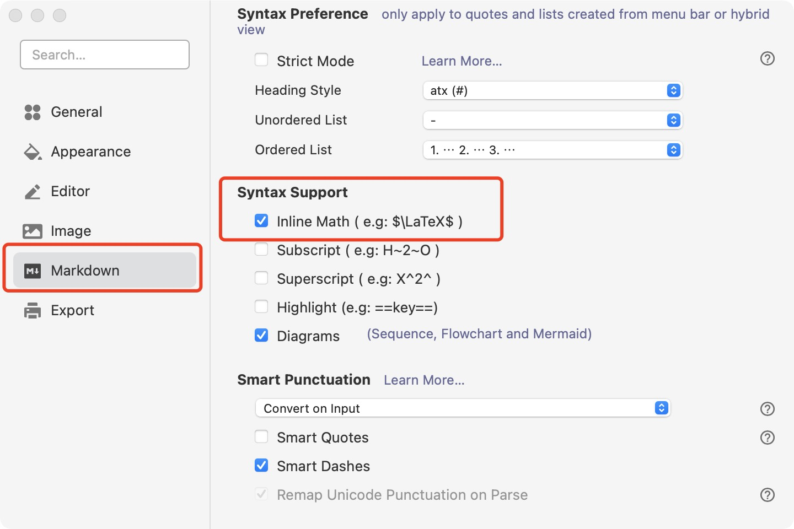

## 内容概述

我们的组队学习将带领大家入门图神经网络，为大家今后在学习和工作中对图神经网络的应用打下基础。学习内容包括：1）简单图论知识，2）实现图神经网络的通用范式，3）分别用于节点、边、图预测的经典图神经网络，以及4）图神经网络的编程实践。我们设计了节点预测、边预测与图预测三项任务，通过此三项任务的实践学习，能让大家具备解决实际应用的一些必要知识与技能。

## 学习内容与时间安排

此组队学习由五个话题组成，每一话题都包含理论部分与实践部分：

- 话题一：**图论与程序中图的操作**
  - 我们将首先学习**简单图论知识**、了解常规的**图预测任务**（见第2节）；
  - 然后学习**基于PyG包的图数据的表示与使用**（见第3节）。*截止时间 06月16日03:00*
- 话题二：**实现图神经网络的消息传递范式**
  - 我们将首先学习**实现图神经网络的通用范式，即消息传递范式**；
  - 其次学习**PyG中的消息传递（`MessagePassing`）基类的属性、方法和运行流程**；
  - 最后学习**如何自定义一个消息传递图神经网络**（见第4节）。*截止时间 06月19日03:00*
- 在话题三：**节点表征学习与节点预测和边预测**
  - **图计算应用中最基础的任务是节点表征（Node Representation）学习**。
  - 我们将以GCN和GAT（两个最为经典的图神经网络）为例，学习**基于图神经网络的节点表征学习的一般过程**；并且通过MLP、GCN和GAT三者在节点分类任务中的比较，学习**图神经网络为什么强于普通的MLP神经网络**，以及**GCN和GAT的差别**（见第5节）。*截止时间 06月23日03:00*
  - 此外，我们还将学习**如何构造一个数据全部存于内存的数据集类**（见第6-1节)；
  - 并学习**基于节点表征学习的图节点预测任务和边预测任务的实践**（见第6-2节）。*截止时间 06月27日03:00*
- 话题四：**超大图上节点表征学习**
  - 我们将首先学习**在超大图上进行节点表征学习面临着的挑战**；
  - 接着学习**应对挑战的一种解决方案**；
  - 最后**通过实践学习超大图节点预测任务**（见第7节）。*截止时间 07月01日03:00*
- 话题五：**图表征学习与图预测**
  - 我们将首先学习**基于图神经网络的图表征学习的一般过程**（见第8节）；*截止时间 07月05日03:00*
  - 接着学习**样本按需获取的数据集类的构造方法**（见第9-1节）；
  - 最后学习**基于图表征学习的图预测任务的实践**（见第9-2节）。*截止时间 07月09日03:00*
- 总结
  - **对本次组队学习进行总结**。*截止时间 07月10日03:00*

除了话题四和话题五都依赖于话题三之外，其余话题都依赖于该话题自身的前一话题。

## 其他

本教程的markdown版本请使用[Typora](https://typora.io/)软件阅读，并对[Typora](https://typora.io/)软件设置为**允许行内公示**：

---

本开源内容由陈荣钦、周郴莲、戴治旭和刘洋组织整理。
