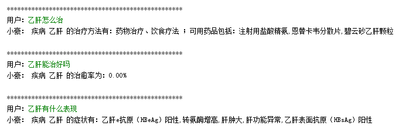

# Datawhale 知识图谱组队学习 之 Task 2 基于医疗知识图谱的问答系统操作介绍

> 文章编写人：芙蕖<br/>
> github 地址：<br/>
> 特别鸣谢：[QASystemOnMedicalGraph](https://github.com/zhihao-chen/QASystemOnMedicalGraph)

## 目录

- [Datawhale 知识图谱组队学习 之 Task 2 基于医疗知识图谱的问答系统操作介绍](#datawhale-知识图谱组队学习-之-task-2-基于医疗知识图谱的问答系统操作介绍)
  - [目录](#目录)
  - [一、引言](#一引言)
  - [二、运行环境](#二运行环境)
  - [三、搭建知识图谱](#三搭建知识图谱)
  - [四、启动问答测试](#四启动问答测试)
  - [参考资料](#参考资料)

## 一、引言

- 该项目主要分为两部分：
  - 第一部分：搭建知识图谱。该部分的具体讲解将在 [ Datawhale 知识图谱组队学习 之 Task 3 Neo4j图数据库导入数据](task03.md)进行介绍；
  - 第二部分：启动问答测试。构建一个简单的基于 知识图谱 的对话系统，该部分的具体讲解将在 [Datawhale 知识图谱组队学习 之 Task 4 用户输入->知识库的查询语句 ](task04.md) 和 [Datawhale 知识图谱组队学习 之 Task 5 Neo4j 图数据库查询 ](task05.md) 进行分别介绍；

- 本节的核心目标是 从 全局对项目的运行过程进行介绍和讲解；学习者能够跑通整个项目。

## 二、运行环境

- python3.0及以上
- neo4j 3.5.0及以上
- jdk 1.8.0

## 三、搭建知识图谱

> 运行该过程，请确保已经安装好 neo4j 和 jdk

运行 以下命令：

```s
    python build_graph.py 
```

> 注：由于数据量比较大，所以该过程需要运行几个小时 

运行介绍之后，打开浏览器进入网址：[http://localhost:7474/browser/](http://localhost:7474/browser/)，可以看到我们导入的数据的知识图谱，如下：


> 图 9 知识图谱 展示图

## 四、启动问答测试

运行 以下命令：

```s
    python kbqa_test.py
```

运行结果如下图所示：



### 五、代码目录介绍
- data:存放数据
- img:存放readme里的图片
- model：存放训练好的tfidf模型和意图识别模型
- build_graph.py:构建图，详见task03
- entity_extractor.py:抽取问句中的实体和识别意图，详见task04
- search_answer.py:根据不同的实体和意图构造cypher查询语句,查询图数据库并返回答案，详见task05

## 参考资料 

1. [QASystemOnMedicalGraph](https://github.com/zhihao-chen/QASystemOnMedicalGraph)
